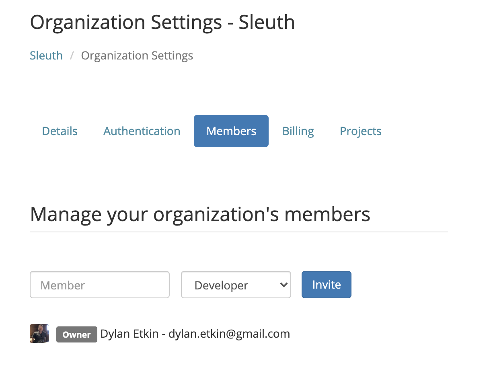

# Members

The **Members** tab allows you to manage the roles of the members of your organization. You can also invite new members to your organization.


You can quickly access the **Members** section of your organization by clicking \*\*Invite People \*\*in the sidebar.


\*\*To invite a new member: \*\*

1. Enter their email address in the Member field.
2. Select a role in the dropdown.
3. Press **Invite**.


Before setting a role, read more about Sleuth's RBAC (role-based access control) implementation in [Role Based Access Control](../access-control.md).


All members of the organization are displayed, along with any invitations that have been sent. You can also revoke the invitation or resend it, if necessary.

In the example shown below, the user **dbowman@sleuth.io** was sent an invitation, but has yet to respond. The invitation can be re-sent or revoked.

.png>)

## Linking External User Identities

As you integrate Sleuth with external tools, Sleuth attempts to link external identities in those tools with internal Sleuth users. Sometimes, however, Sleuth might fail to detect that an external identity should be tied to a given Sleuth user.&#x20;

You can manually view and manage linked identities for Sleuth users by performing the following steps:

* From the **Members** tab, click the ellipsis next to any Member in the listing and select **Link Identities**. The **Link external identities** screen appears.
* The **Link external identities** screen shows all currently linked identities for the user along with options to remove existing identities or to link new ones.
* To search for additional identities not already linked to the user, click **Link**&#x20;

 (1) (2).png>)

