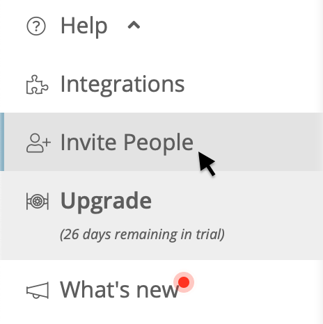

# Members

The **Members** tab allows you to manage the roles of the members of your organization. You can also invite new members to your organization. 


You can quickly access the **Members** section of your organization by clicking **Invite People** in the sidebar.  


**To invite a new member:** 

1. Enter their email address in the Member field. 
2. Select a role in the dropdown. 
3. Press **Invite**. 


Before setting a role, read more about Sleuth's RBAC \(role-based access control\) implementation in [Role Based Access Control](../access-control.md). 


All members of the organization are displayed, along with any invitations that have been sent. You can also revoke the invitation or resend it, if necessary. 

In the example shown below, the user **dbowman@sleuth.io** was sent an invitation, but has yet to respond. The invitation can be re-sent or revoked. 

