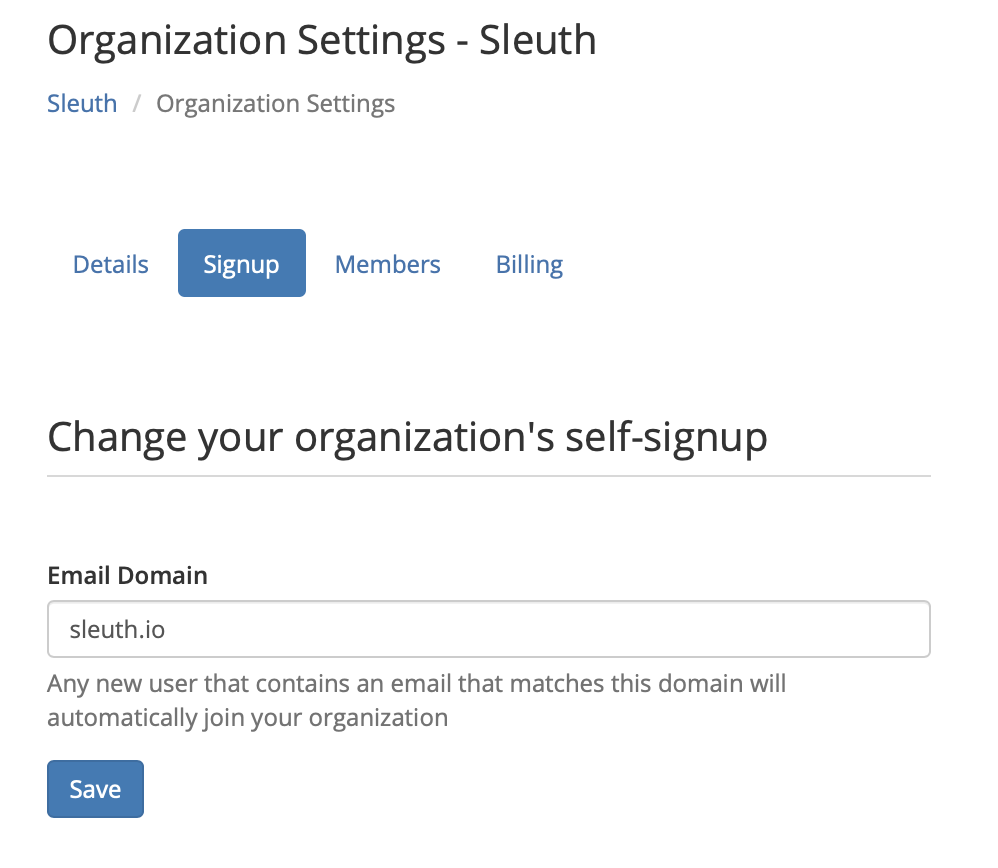

# Signup

The **Signup** tab makes it easy for new members to access all of the integrations of your organization \(i.e., self-signup\). When inviting people to join your organization, if their email address domain matches the domain in the **Email Domain** field, then they will automatically be part of your organization. 

* To change the email domain, enter a new domain and press **Save**. 

