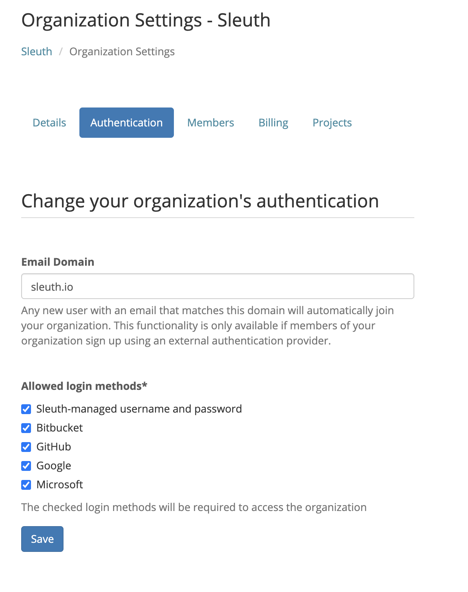

# Authentication

The **Authentication** tab makes it easy for new members to access all of the integrations of your organization \(i.e., self-signup\) and to manage what kinds of authentication your team can use to sign into Sleuth. 

## Domain Based Sign ups

To allow any user that signs up with your organizations email domain to automatically join your Organization set the email domain to your Organization's domain and click save.


You can only set the domain to the email domain you've signed up with and confirmed. Signing up via a third party provider automatically confirms your email. If you've signed up with an email address to Sleuth you will find a confirmation link in your email. 


## Allowed login methods

You main constrain the login methods allowed for your Organization to any/all of the methods Sleuth supports. To modify this uncheck any methods you don't want allow and click Save.

