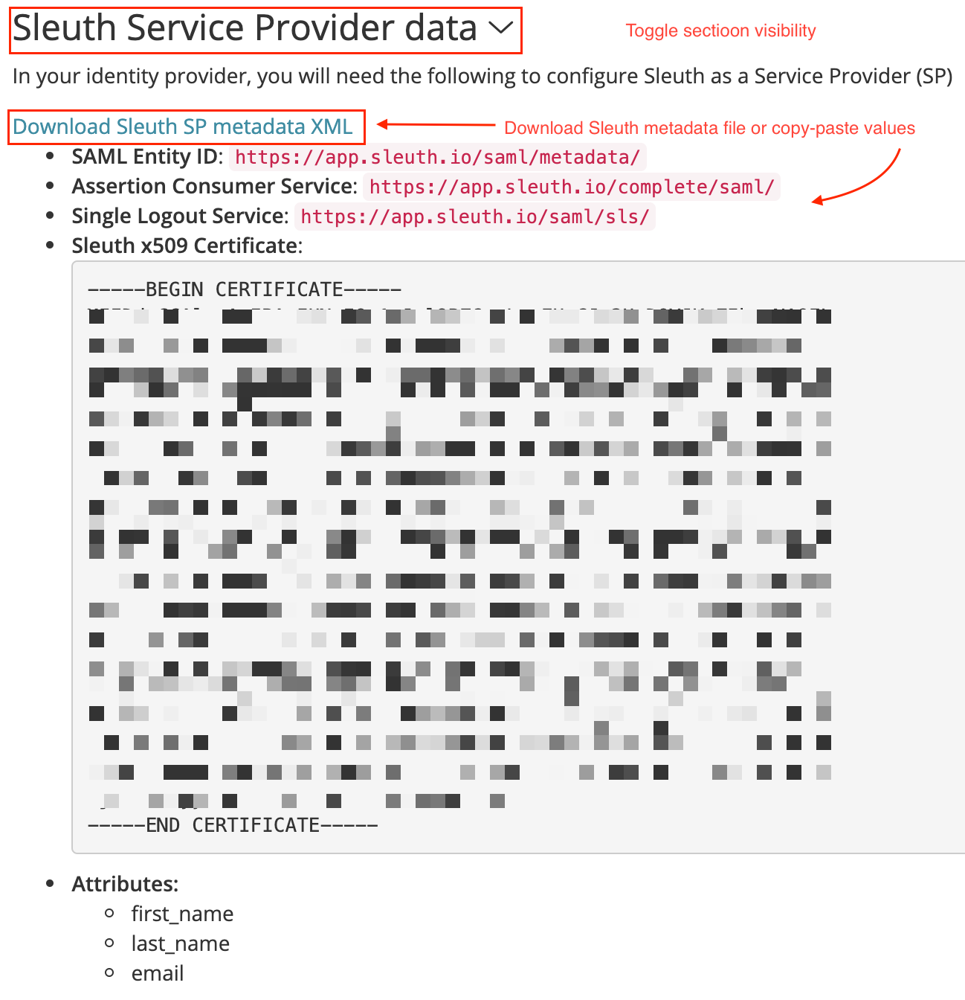

# SAML 2.0 Setup

To set up SAML integration you will need admin privileges in Sleuth and in your Identity Provider (IdP) system that supports SAML 2.0. Regardless of the specific IdP, the general setup process is roughly the same:

1. Gather Sleuth Service Provider (SP) Metadata: this is the information you will need in order for your IdP to identify Sleuth as a trusted service provider.
2. Establish Sleuth as a trusted SP in your IdP: this step requires administrator privileges in your IdP
3. Entering IdP metadata to Sleuth: finalize communication configuration between Sleuth and IdP
4. Enable SAML login for users

To begin SAML configuration navigate to the Authentication tab under Organization settings and click "_Configure SAML Authentication" _ 

## Gathering Sleuth Service Provider Metadata

To view Sleuth SAML metadata expand "Sleuth Service Provider data" section. There you can either download metadata XML file if your IdP supports metadata file imports or manually copy-paste these values when setting up Sleuth as a trusted service provider within your IdP.

## Establish Sleuth as a trusted Service Provider

To establish Sleuth as a trusted SP you will need information from the previous step and administrator privileges in your IdP.

This section includes instructions on how to configure your Identity Provider in order to enable the login:

* [Okta](okta-configuration.md)


Even if your Identity Provider is not specified on the list above, Sleuth is respecting the SAML 2.0 standard so you can integrate every Identity Provider that supports the standard.

Feel free to contact us at support@sleuth.io in case of any problems setting up the integration.


## Entering Identity Provider Metadata

You can either enter IdP information manually or you can provide Sleuth a URL where the IdP metadata file is available. In the case of providing the file URL, Sleuth will take the file, validate the metadata and automatically populate the configuration parameters.

Sleuth defaults all of the advanced configuration to the most commonly used values, but depending on your IdP configuration you might need to adjust advanced settings.

.png>)

Click "_Test Metadata and Save_" to finish creating the configuration.

## Enable SAML login

Once you saved the configuration you will need to successfully log in using SAML before you can set it to be your only [allowed login method](../#allowed-login-methods).

1. Log out of Sleuth
2. On the login page: enter your email and click "_Continue_"
3. Clicking on "SAML" will start the login process via your IdP
