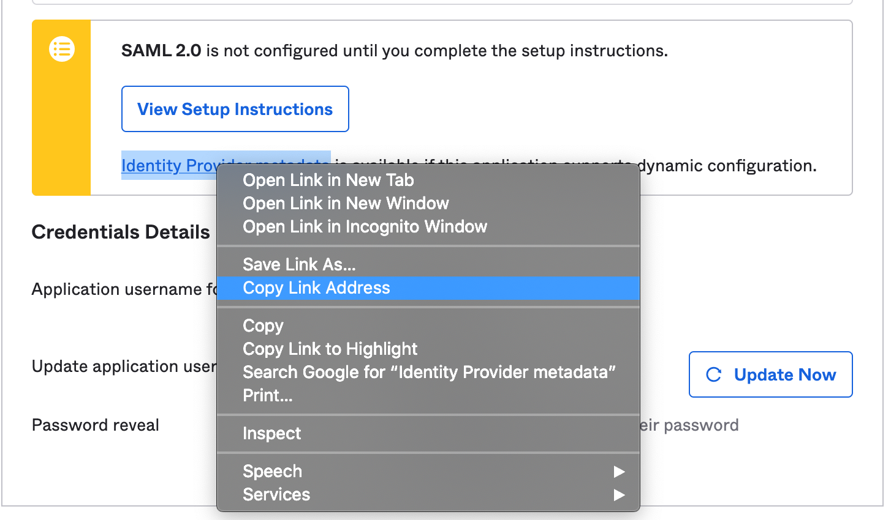

# Okta configuration

1. Sign in to Okta as an administrator
2. Follow Okta [documentation on setting up SAML application](https://developer.okta.com/docs/guides/build-sso-integration/saml2/overview/#organizations)
3. On the "_Configure SAML_" screen enter the data collected from Sleuth 
   1. Enter Sleuth's **Assertion Consumer Service** as _"Single sign on URL"_ 
   2. Enter Sleuth's **SAML Entity ID** as "_Audience URI \(SP Entity ID\)"_
   3. Set "_Name ID format"_ as "EmailAddress"
4. Set **Attribute Statements**
   1. **email** -&gt; user.email
   2. **first\_name** -&gt; user.firstName
   3. **last\_name** -&gt; user.lastName
5. Optional: if you want users logged out of Okta application when they log out of Sleuth:
   1. Click "_Show Advanced Settings_"
   2. Next to "_Enable Single Logout_", select the checkbox "_Allow application to initiate Single Logout_"
   3. Enter **Single Logout Service** URL from Sleuth
   4. Paste Sleuth's **SAML Entity ID** value to "_SP Issuer"_ field
   5. Click "_Browse"_  next to "_Signature Certificate"_ and upload **Sleuth x509 certificate**
6. Continue clicking through Okta set up until finished
7. Upon wizard completion, you are ready to import Okta metadata into Sleuth. On the application "_Sign On_" tab right-click on "_Identity Provider metadata"_  and select "Copy Link Address" and use this as **point Sleuth to metadata file URL** _****_in the next step of setting up SAML integration: [Entering Identity Provider Metadata](./#entering-identity-provider-metadata)

