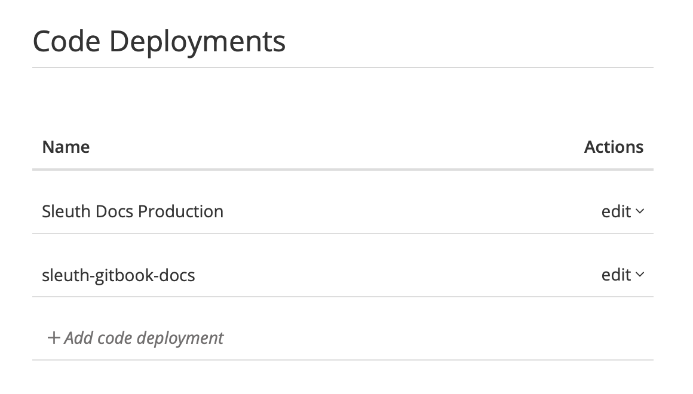

# Code Deployments

The **Code Deployments** tab in [Project Settings](./) is where configuration changes are made to the code deployment change sources in your project. Additionally, you can manage the mapping of your repositories and branches to your environments. 

Code deployments track deploys, which collect the code changes, pull requests, issues, and authors deploying to your environment. Additionally, with code deployments you can: 

* Capture the code reviews in each deploy;
* Generate a ChatOps notification of a deploy;
* Preview what changes a deploy will contain.

To edit code deployments, click the _edit_ dropdown in the Actions column then select **Edit** to view the _Edit Code Deployment_ screen \(shown below\).   
  
  

Make changes as needed to your code deployment. On this screen, you can: 

* Select the code **repository** for your code deployment change source in the Repository dropdown. 
* Select the **branch** in the repository that you wish to use for the code deployment change source. Only branches in the repo selected above are displayed. Sleuth will, by default, select the _master_ branch. 
* Change the name of the code deployment, which is shown in the _Code Deployment_ section of the sidebar. 
* Select how Sleuth will track changes in the _Deploy tracking type_ dropdown. The available selections are: 
  * **Manually register each deploy:** Selecting this allows you to use the Sleuth API to manually submit HTTP POST requests. This is especially handy if you have additional processes that must be completed after you deploy, in which case you can notify Sleuth only when all of your post-deploy processes are completed. 
  * Automatically create deploys for every tag: 
  * Automatically create deploys for every push to branch: 

