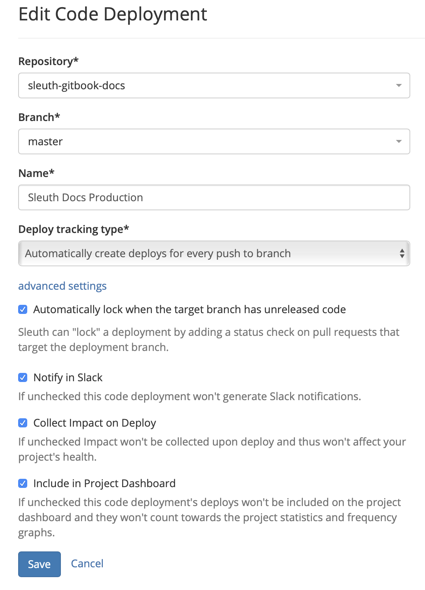
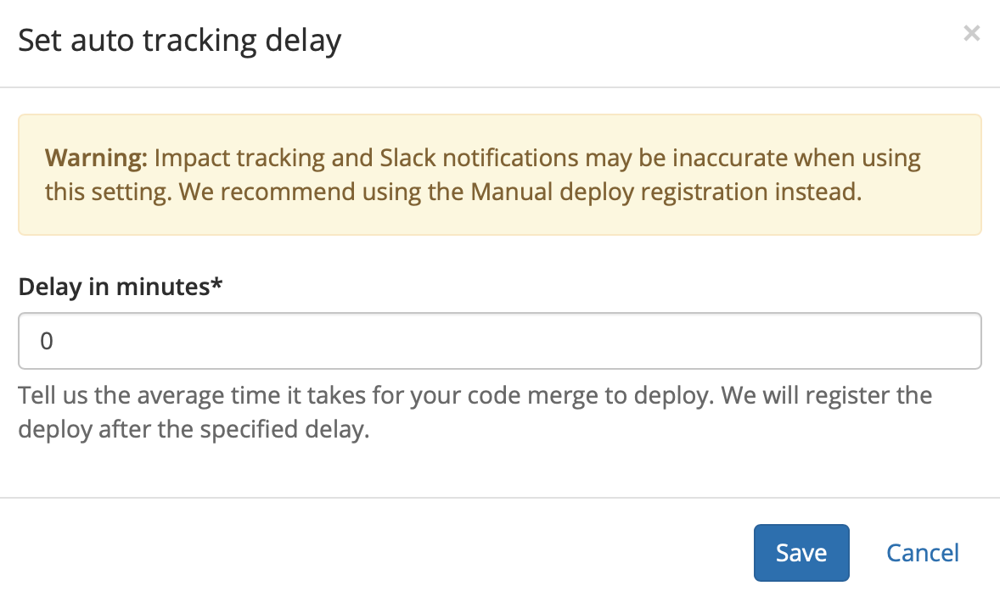
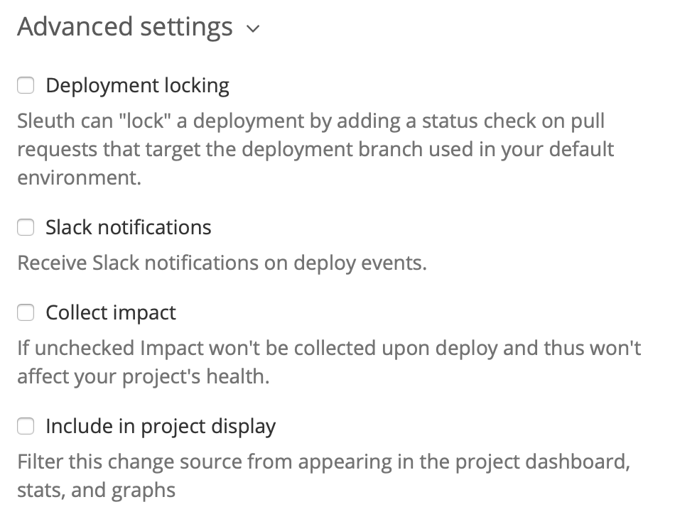

# Code Deployments

The **Code Deployments** tab in [Project Settings](./) is where configuration changes are made to the code deployment change sources in your project. Additionally, you can manage the mapping of your repositories and branches to your environments. 

Code deployments track deploys, which collect the code changes, pull requests, issues, and authors deploying to your environment. Additionally, with code deployments you can: 

* Capture the code reviews in each deploy;
* Generate a ChatOps notification of a deploy;
* Preview what changes a deploy will contain.

### Edit Code Deployments

To edit code deployments, click the _edit_ dropdown in the Actions column then select **Edit** to view the _Edit Code Deployment_ screen \(shown below\).   
  
  

Make changes as needed to your code deployment. On this screen, you can: 

* Select the code **repository** for your code deployment change source in the Repository dropdown. 
* Select the **branch** in the repository that you wish to use for the code deployment change source. Only branches in the repo selected above are displayed. Sleuth will, by default, select the _master_ branch. 
* Change the name of the code deployment, which is shown in the _Code Deployment_ section of the sidebar. 
* Select how Sleuth will track changes in the _Deploy tracking type_ dropdown. The available options are: 
  * _**Manually register each deploy:**_ Enables you to use the Sleuth API to manually submit HTTP POST requests. This is especially handy if you have additional processes that must be completed after you deploy, in which case you can notify Sleuth only when all of your post-deploy processes are completed. 
  * _**Automatically create deploys for every tag:**_ Sleuth creates a deploy when a new tag is pushed to a repo. 
  * _**Automatically create deploys for every push to branch:**_ ****Sleuth creates a deploy every time there is a push to the selected branch. 

Press **Save** after making any changes. 

### Auto tracking delay

If you make any changes to any code deployment settings and press **Save**, you will be prompted to enter an auto tracking delay value. The default value for this field is **0**. This means Sleuth will begin evaluating the impact of your code as soon as it's deployed, and also generate and send any notifications about your deployment via the [Slack integration and/or email notifications](../../notifications.md) that have been configured. 

Depending on your production environment and how your application deployment pipeline is set up,  impact information and Sleuth-generated notifications might not reflect the real-time deployed state of your application, as Sleuth begins analyzing your deployment immediately. 

Enter the average time, in minutes, it takes for your code merge to deploy, then press **Save**. 

### Advanced Settings

Additional configuration options allow you to fine-tune the behavior of Sleuth when it detects deploys via your change sources. 

#### Deployment locking

Selecting this checkbox allows Sleuth to automatically lock a deployment if there is a pull request made to your deployment branch. Without this enabled, you can still lock a deployment manually in the Slack notification or in the Dashboard of the active project. 

#### Slack notifications

Selecting this checkbox lets Sleuth send Slack notification through your Slack integration. You can configure these notifications in the [Slack Notifications tab](slack-notifications.md) of Project Settings. 

#### Collect impact

Selecting this checkbox lets Sleuth collect impact information collected through your [error and metric impact integrations](../../integrations-1/impact-sources/). The information is collected, analyzed, then displayed in the deploy card of each deployment. You will need to configure these integrations in the error and metric impact tools themselves \(i.e., Datadog, Sentry, Rollbar, etc.\). 

#### Include in project display

Selecting this checkbox displays the code deployment in the project dashboard, along with the associated stats and graphs in the deploy cards. 

