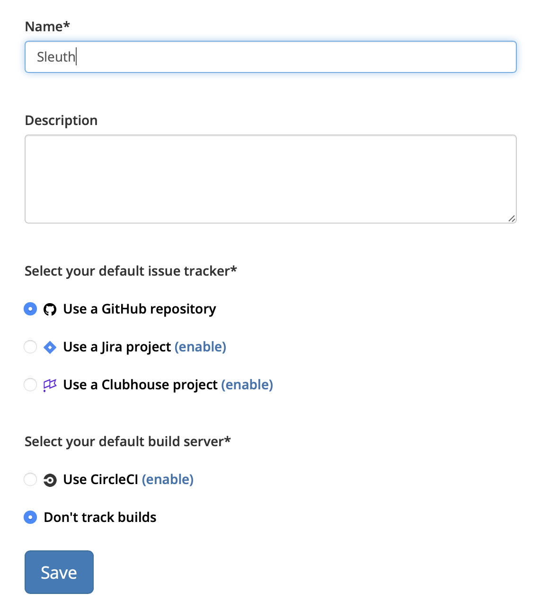

# Details

The **Details** tab contains general information about the selected project. The name of selected project is displayed at the top of the sidebar, under **Project**. Select the dropdown to select a different project if you have more than one project. 

You can change the name of your project in the Details tab, along with an optional descripting for the project. This is helpful if you are on a large team with multiple projects within the organization. 

You can also change the default issue tracker for the selected project and, if a [Build](../../integrations-1/builds/) integration has been established, a default build server. Selecting a build server is optional, but at least one [issue tracker](../../integrations-1/issue-trackers/) must be integrated and set as the default. A link to enable an issue tracker is provided if the integration has not been made by the organization the project belongs to. 

Press **Save** after making modifications in the Details tab. 

