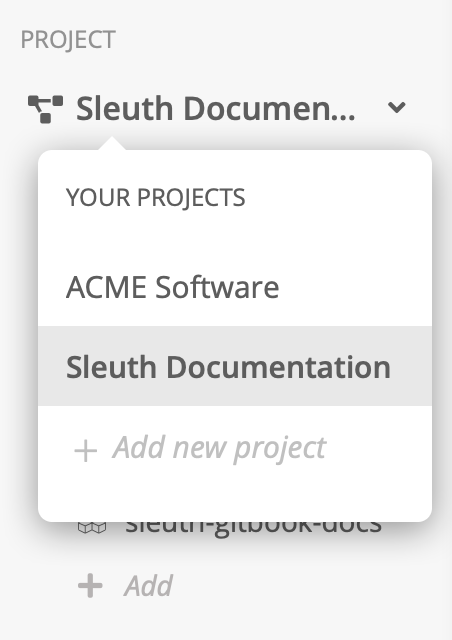

# Environments

Sleuth's environment support lets you define change sources once per project but can then register changes to them across all environments within the project. This Sleuth exclusive feature lets you model your deploys across all of your environments, giving you visibility to how your code behaves across different environment variables.  

Environment modifications are made at the Sleuth [project](../../projects.md) level, and contain all the settings and configuration states for each environment, such as _staging, testing,_ and _production_. You can easily integrate with your existing DevOps tools to intelligently organize environmental attributes. 

Using environments means that every code deployment you create is represented in all of your environments. When you register a deploy against the [Sleuth API](../../resources/api-reference.md) you can specify an environment parameter that tells Sleuth which environment is being deployed to. If separate branches are used for your deploys, you can map those branches in the code deployment edit screen. 

* If using [manual deployments](../../resources/api-reference.md#manual-deploy-registration), you can specify the environment on the HTTP POST as the 'environment' field or let it default to the project's default environment.
* A project always has at least one default environment. 
* Environments map to a single branch by default. You can change this behavior, and map multiple environments to multiple branches. 
* If applicable to the integration, Sleuth will try to map environments to Sleuth environments based on their names \(i.e., LaunchDarkly staging to Sleuth staging\). You can manage these mappings in Project Settings. 

### Creating a new environment


You can set any environment as the default environment by clicking **edit**, then seleting **Set as default**. In the Project view, the default environment is displayed first. 



A project will always contain at least one environment, and can contain as many environments as needed. 


1. Select the project you wish to add new environments to in the Project selector.    
2. In the sidebar, click **Project Settings**. 
3. Click the **Environments** tab. 
4. Click **Add environment**. 
5. Give your new environment a name and, optionally, a description, then press **Save**. 


Your new environment is displayed in the Environments list. From here you can click **edit** to rename you environment, set it as the default environment, or delete it. 


### Mapping branches to environments

By default Sleuth maps the _master_ branches to all environments in your project. However, you can change this behavior to deploy different repos to other environments. For example, you might wish to deploy your _master_ branch to _production_, which is the default behavior, and deploy your _staging_ branch to your _staging_ environment, and so on. 

This behavior can be configured across your project settings, and include Slack notifications, code deployments, feature flags, and impact sources. 

#### To change environment mappings for code deployments


When creating a code deployment, by default it will exist in all environments unless you choose to designate specific branches to environments by turning this feature on.


1. Select the project you wish to change mappings to in the Project selector.    
2. Click the **Code Deployments** tab. 
3. Find the code deployment you wish to change mappings in, then click the _edit_ dropdown and select **edit**. 
4. In the **Branch** section, enable the _Map separate branches to environments_ checkbox. 
5. In the dropdown next to each of your environments, select the repo to map to each environment. 
6. Press **Save**.  

#### To change environment mappings for feature flags


Environments in LaunchDarkly map automatically to environments in Sleuth. With the LaunchDarkly integration, Sleuth matches environment names \(i.e., LaunchDarkly Staging environment will be mapped to your Sleuth Staging environment\). You can change these default mappings at any time by following the instructions below.  



You must have a [LaunchDarkly integration](../../integrations-1/change-sources/feature-flags/launchdarkly.md) in your organization before you can configure feature flag mappings. 


1. Select the project you wish to change feature flag mappings in the Project selector.    
2. Click the **Feature Flags** tab. 
3. Select the LaunchDarkly project that contains the environments you wish to map in the _LaunchDarkly Projec_t dropdown. Sleuth automatically displays the environments found in the selected LaunchDarkly project in the **LaunchDarkly Environment** section. 
4. Sleuth applies default mappings based on environment names; however, you can change the mappings by selecting a different environment in the dropdowns. The mapped Sleuth environment is displayed next to the LaunchDarkly environments.  
5. Press **Save**.  

#### To change environment mappings for impact sources

1. Select the project you wish to change impact source mappings in the Project selector.    
2. Click the **Impact** tab. All metric and error impact sources are displayed. 
3. Select the impact source you wish to modify, then click the _edit_ dropdown. The interface might change depending on the type of impact source you're editing \(e.g., Datadog metric, Sentry error, etc.\).
4. _For Metric Sources, such as Datadog:_ Select the environment you wish to add as a change source in the **Environment** dropdown. Press the **Test query** button to ensure your connection has not been affected. The result of your query will be displayed next to the button \(e.g., _Latest value: +49.879289_ might be displayed for a Cluster Memory metric\).   _For Error Sources, such as Sentry:_ Select the environment you wish to add as a change source in the Environment dropdown. 
5. Press **Save**.  

### Editing environment parameters

1. Select the project whose environments you wish to edit in the Project selector.    
2. In the sidebar, click **Project Settings**. 
3. Click the **Environments** tab. 
4. Find the environment you wish to modify, then click the _edit_ dropdown. 
5. Select one of the following options:  _**Rename**:_ Enter a new name in the _Name_ field. You can also edit or add a _Description_, if you wish, then press **Save**.  _**Set as default**_: This sets the selected environment as the default environment. All new environments created obtain the settings of the default environment. This option is not available in the default environment's _edit_ dropdown.  _**Delete**_: Removes the selected environment from your project. All mappings revert to the default environment.


You cannot delete the default environment. To delete a default environment, choose another environment as the default first, then delete the environment. 


 Converting \(migrating?\) projects to environments

Don't worry if you've been modeling environments by creating separate projects in Sleuth. The process for migrating to our new [IA](../../resources/terminology.md#information-architecture-ia) \(Information Architecture\) couldn't be simpler.  

