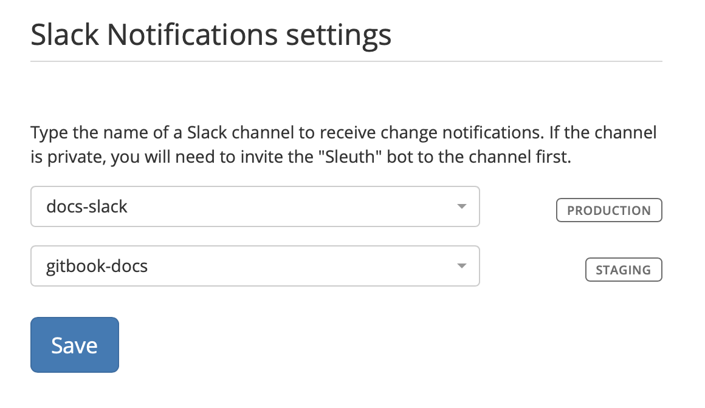

# Slack Notifications

The Slack Notifications tab is where you configure which Slack channels receive change notifications when a deploy occurs in a specific environment. 

Press **Save** to save any modifications made in the Slack Notifications tab. 

