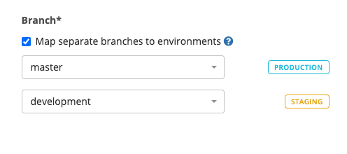

# Code deployment settings

The **Code Deployments** tab in [Project Settings](./) is where configuration changes are made to the code deployment change sources in your project. Additionally, you can manage the mapping of your repositories and branches to your environments.

## Adding a Code deployment

To add a code deployment, first make sure you have the necessary permissions.


See [Code deployment](../../integrations-1/code-deployment/) to see which source provider Sleuth supports.


## Edit Code Deployments

To edit code deployments, click the _edit_ dropdown in the Actions column then select \*\*Edit \*\*to view the _Edit Code Deployment_ screen (shown below).\
\

Make changes as needed to your code deployment. On this screen, you can:

* Select the code **repository** for your code deployment change source in the Repository dropdown.
* Select the **branch** in the repository that you wish to use for the code deployment change source. Only branches in the repo selected above are displayed. Sleuth will, by default, select the _master_ branch. If you use different branches to deploy to different environments see the _Mapping branches_ section below.
* Change the name of the code deployment, which is shown in the _Code Deployments_ section of the sidebar.
* Select how Sleuth will track know when you've deployed. See [How to register a deploy](../../modeling-your-deployments/code-deployments/how-to-register-a-deploy.md) for more details.

### Mapping branches to environments

By default Sleuth maps the _master_ branch to all environments in your project. However, you can change this behavior if you used named branches for your other environments. For example, you might wish to deploy your _master_ branch to _production_, which is the default behavior, and deploy your _staging_ branch to your _staging_ environment.

## Advanced Settings

Additional configuration options allow you to fine-tune the behavior of Sleuth when it detects deploys via your change sources.

### Source path prefix (include)

Restricts deployment information to only files matching the entered path prefix. This feature is especially useful for mono-repos.

In the example below, only files located in the `sleuth/apps/pullrequests` directory will be included in deploys. You can specify multiple paths to include by specifying a comma separated list of paths.&#x20;

This can be used in conjunction with Source path prefix excludes, see below.

### Source path prefix (excludes)

Restricts deployment information to only files **not** matching the entered path prefix. This feature is especially useful for mono-repos.

In the example below, only files **not** located in the `sleuth/apps/pullrequests` directory will be included in deploys. You can specify multiple paths to exclude by specifying a comma separated list of paths.&#x20;

This can be used in conjunction with Source path prefix includes, see above.

### Automatically lock deployments

Selecting this checkbox allows Sleuth to automatically lock a deployment when a pull request merged to your deployment branch (Sleuth will then unlock the code deployment once that change has deployed). Without this enabled, you can still lock a deployment manually in the Slack notification or in the Dashboard of the active project by clicking the **Lock** button.

### Slack notifications

Selecting this checkbox lets Sleuth send Slack notification through the Sleuth DORA App for Slack. You can configure these notifications in the [Slack Notifications tab](slack-notifications.md) of Project Settings.

### Collect impact

Selecting this checkbox lets Sleuth collect impact information collected through your [error and metric impact integrations](../../integrations-1/impact-sources/). The information is collected, analyzed, then displayed in the deploy card of each deployment. You will need to configure these integrations in the error and metric impact tools themselves (i.e., Datadog, Sentry, Rollbar, etc.).

### Track builds with

Build tracking is set at the project level. However, if you have a code deployment that uses an alternative build provider you can set that with this field.
