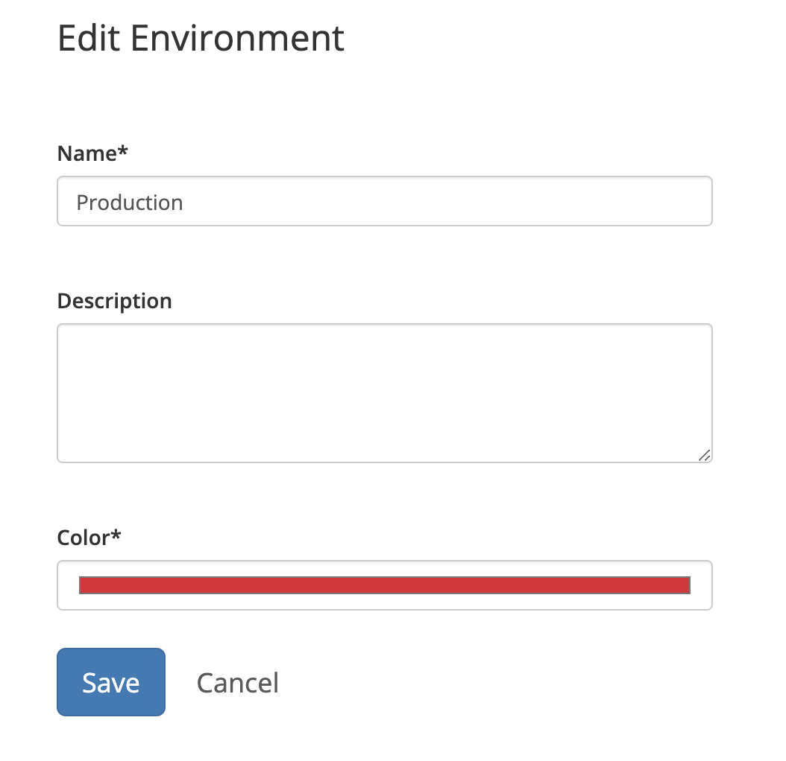

# Environment settings

The **Environments** tab in [Project Settings](./) is where configuration changes are made to the environments contained in your project. 

## Creating a new environment

1. Select the project you wish to add new environments to in the Project selector.    
2. In the sidebar, click **Project Settings**. 
3. Click the **Environments** tab. 
4. Click **Add environment**. 
5. Give your new environment a name and, optionally, a description, then press **Save**. 


You can set any environment as the default environment by clicking **edit**, then selecting **Set as default**. In the Project view, the default environment is displayed first. 



A project will always contain at least one environment, and can contain as many environments as necessary. 


## Editing environments

1. Select the project whose environments you wish to edit in the Project selector.    
2. In the sidebar, click **Project Settings**. 
3. Click the **Environments** tab. 
4. Find the environment you wish to modify, then click the _edit_ dropdown. 
5. Select one of the following options:    **Edit**_:_ Change the environment name, description, and the color of the lozenge in the environment picker.  **Set as default**: This sets the selected environment as the default environment. All new environments created to obtain the settings of the default environment. This option is not available in the default environment's _edit_ dropdown.  **Delete**: Removes the selected environment from your project. Any mappings that you made revert to the default environment.


You cannot delete the default environment. To delete a default environment, choose another environment as the default first, then delete the environment. 


