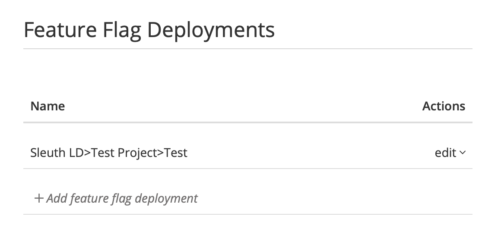
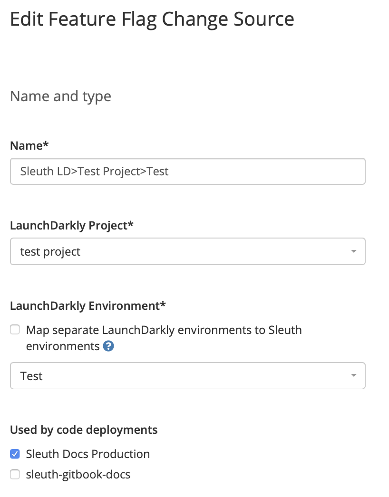
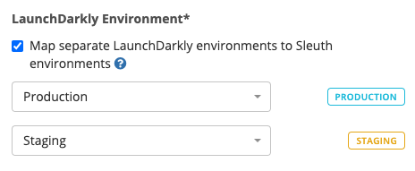
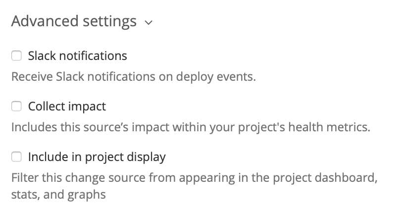

# Feature flag settings

The **Feature Flags** tab in [Project Settings](./) is where configuration changes are made to the feature flag change sources in your project. Additionally, you can manage the mapping of Sleuth environments to your LaunchDarkly environments. 

Feature flag change sources track changes made by the feature flags deployed in your application and that have been integrated with Sleuth. Changes are associated to code deployed in your environments. You can also: 

* Capture the flag changes being made
* Generate Slack notifications of a flag change
* Link your flag changes to deployed code


You must have a [LaunchDarkly integration](../../integrations-1/feature-flags/launchdarkly.md) in your organization before you can configure feature flags.


## Edit Feature Flag

To edit feature flag change sources, click the _edit_ dropdown in the Actions column then select **Edit** to view the _Edit Feature Flag_ screen \(shown below\).

   
  
Make changes as needed to your feature flags. Here you can: 

* Change the **name** of the feature flag change source, which is shown in the _Feature Flags_ section of the sidebar. 
* Select the LaunchDarkly **project** that contains the feature flags you want to track in Sleuth. 
* Select the LaunchDarkly **environment** you want to track with this feature flag change source. Only the environments that are contained in the LaunchDarkly project selected above will be displayed. If you enable the _Map separate LaunchDarkly environments to Sleuth environments_ checkbox, you can map multiple LaunchDarkly environments to your Sleuth environment \(see next section\). 
* Select code deployments shown in the _Used by code deployments_ list to link your feature flag changes to. Deployed code that contain feature flags that have been configured in the LaunchDarkly project and environment\(s\) configured above will be included in the data displayed in the Dashboard. 

### Mapping feature flag environments to Sleuth environments

To correctly attribute feature flag changes to the right Sleuth environment you must map your LaunchDarkly environments to your Sleuth environments. This feature is only available if you have two or more Sleuth environments \(and two or more LaunchDarkly environments\).

## Advanced Settings

Additional configuration options allow you to fine-tune the behavior of Sleuth when it detects deploys via your feature flag change sources. 

### Slack notifications

Selecting this checkbox lets Sleuth send Slack notification through your Slack integration. You can configure these notifications in the [Slack Notifications tab](slack-notifications.md) of Project Settings. 

### Collect impact

Selecting this checkbox lets Sleuth associate impact information with feature flags. If unchecked Impact measurements won't be attributed to changes made via feature flags.

### Include in project display

Selecting this checkbox displays the feature flags in the project dashboard, along with the associated stats and graphs in the deploy cards. 

