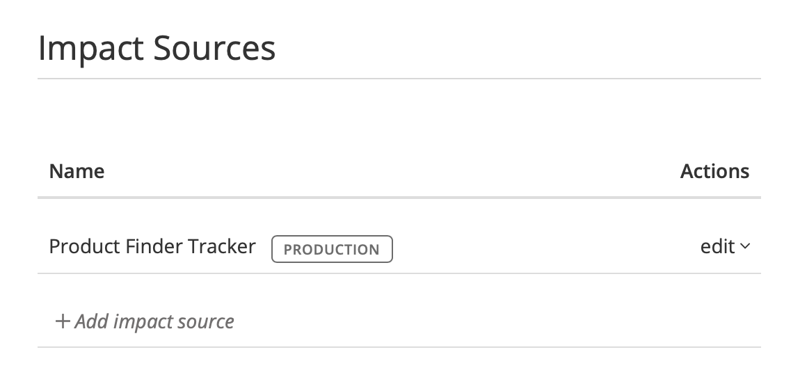
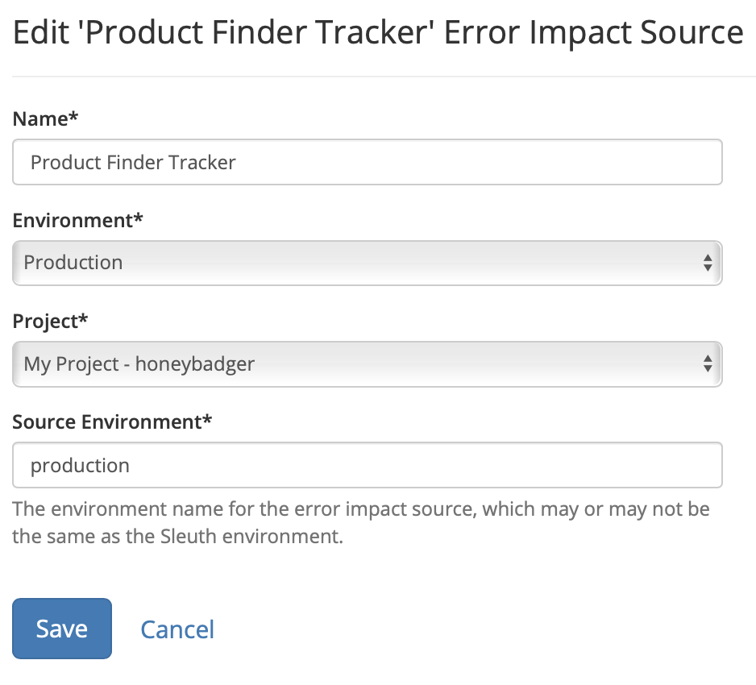
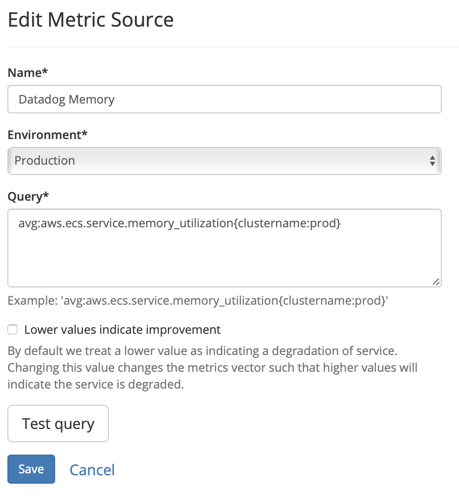

# Impact settings

The **Impact** tab in [Project Settings](./) is where configuration changes are made to the impact sources in your project. Impact sources allow to Sleuth verify your deploys health by tracking the values from your **errors** or **metrics** and associating them with your deploys.

## Edit Error Impact Source

To edit error impact sources, click the _edit_ dropdown in the Actions column then select **Edit** to view the _Edit Error Impact_ _Source_ screen.


Error Impact's only apply to the specified Environment. If you have an Error impact that applies to more than one Environment you must create a second one that maps to that Environment.


## Edit Metric Source

To edit metric sources, click the _edit_ dropdown in the Actions column then select **Edit** to view the _Edit Metric_ _Source_ screen.


Metric Impact's only apply to the specified Environment. If you have an Metric impact that applies to more than one Environment you must create a second one that maps to that Environment.


