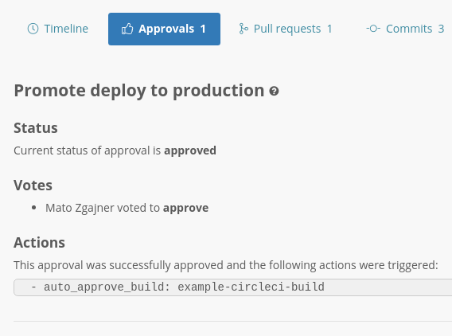

# Approvals

Approvals are an important component of Sleuth Actions that allows you to set up custom approval-based workflows. They are typically triggered by particular deploys, display an interactive dialog in Slack and execute various actions upon successful approval.

Let's walk through a real-life scenario and see how they work.

## Setting up an approval

Imagine we'd like to set up an approval that triggers every time a deploy is made to our _Staging_ environment and allows developers to promote code to the _Production_ environment.

First, visit the deployment page of a code deployment and select _Add an approval_ from the cogwheel menu in the top right corner.

This will open the approval creation wizard and guide you through the process.

Read the introduction and move to the second step by clicking _Next_.

Specify a name for your approval, select the _Staging_ environment \(because we want approvals to show up after we deploy to _Staging_\) and define various aspects of the approval dialog, such as the Slack channel to display it in.

Under _Action_, select the action that should be executed once the approval is successfully approved. In our case, we want to approve an existing preconfigured CircleCI build that will promote that same code to _Production_.

The most powerful way to use approvals is to have an action that triggers a CI/CD build. In this way you can use Sleuth to define your deployment workflow. See our documentation on how to configure build triggers for more details.



Once you're happy with the configuration, move to the final step by clicking _Next_ again.

The final step will provide you with the contents of a configuration file and specific instructions on how to enable it by adding it to your code repository. Once you do that, Sleuth will automatically parse it and display an approval on your next deploy.

## Interacting with the approval

The configuration we just defined in the example above will display the following approval dialog in Slack every time a deploy is made to the relevant code deployment.

Once a member of your team clicks _Approve_ or _Reject_, their vote will be recorded and the approval dialog will update.

If the approval is successful, the configured action\(s\) are automatically executed in the background - in this case that means our CircleCI build is approved.

## Inspecting approval logs

Sleuth keeps track of your approvals to provide additional visibility. If you ever need to find out exactly what happened on a specific deploy, visit its detail page and open the _Approvals_ tab.

Here, you can see which approvals were triggered by the deploy, how your team members voted on them  and what actions were triggered as a result.

