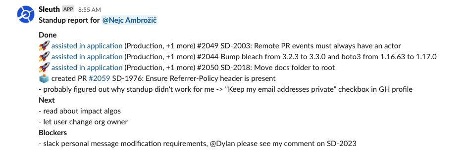

# Developer standup

Tired of trying to remember what you did yesterday? Me too. The Sleuth Slack standup command helps you build your standup report, pre-populating it with your deployments and other pull request development activity. Run this in any Slack channel:

```text
/sleuth standup
```

And you'll see a dialog that when submitted, reports your standup to the channel:






