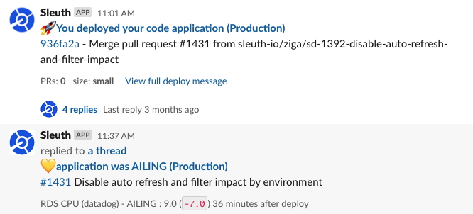
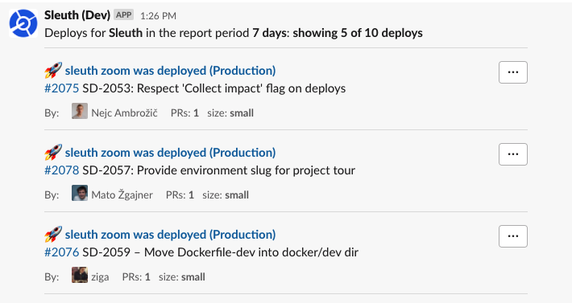

# Personal notifications

As a developer, how do you know when you code has really been deployed? If you are lucky your deploy process takes 5 minutes and you're the one running it. However, for most of us, deploys take longer, or maybe even don't involve you when things actually ship to production.

Sleuth's got your back! Personal Slack notifications will notify the authors of change when their code is deployed.

Even better, if your team is using [auto-deploy verification](../auto-verify-your-deploys/) Sleuth will tell you when your change has caused a problem.

Personal notifications aren't just for Developers. Sleuth will alert anyone involved in the [issues](../integrations-1/issue-trackers/) deployed as well. If you are PM or Designer that's trying to understand when work is really hitting your customers, Sleuth is your best friend.

## Slack deploy summaries

Sleuth provides individuals a daily, weekly, bi-weekly or monthly summary of what was deployed, delivered right to you via Slack!

These can be configured via the [project](../modeling-your-deployments/projects/) or [deployment](../modeling-your-deployments/code-deployments/) dashboards.

 (1) (1).png>)

Once enabled you'll receive the same rich deploy Slack notifications you've come to expect from Sleuth delivered right to you.

