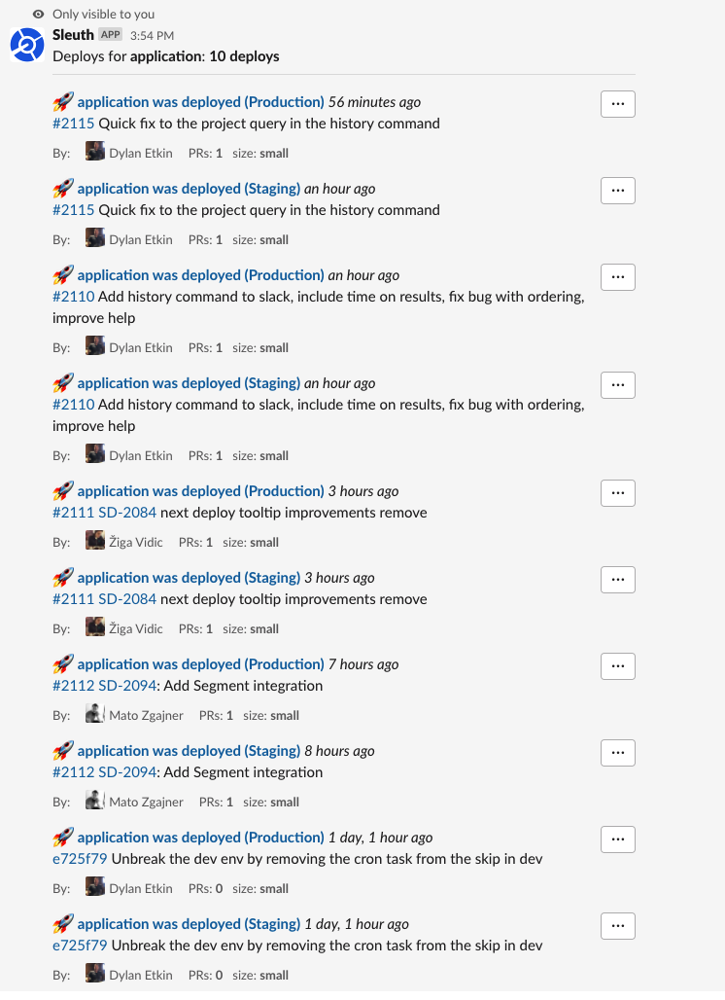

# Project/Deployment history

Sometimes you just need to know what the last few deploys were for your [project](../modeling-your-deployments/projects/) or [deployment](../modeling-your-deployments/code-deployments/).

With the Sleuth history Slack command you can see that context right from Slack.

```text
/sleuth history [project name/slug | deployment name/slug]
```



