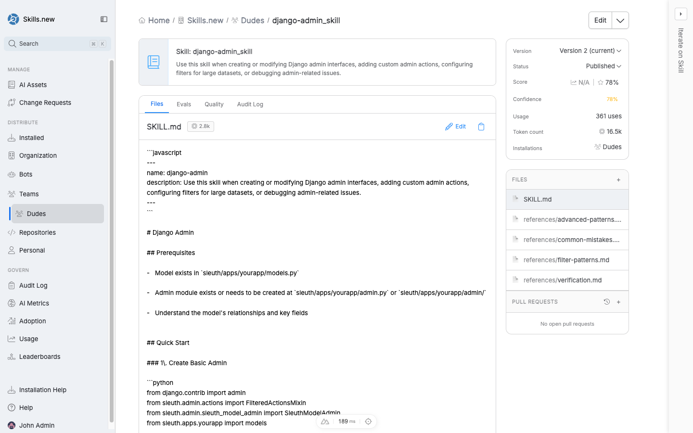

# Assets

An **asset** is any artifact you publish to Sleuth Skills that shapes how an AI client behaves: a skill, a rule, an agent, a command, a hook, an MCP server, or a Claude Code plugin bundle. Assets are the things engineers create; [installation targets](../installation-targets/README.md) are how you decide who sees them.

<figure><figcaption>
The AI Assets list — filter by type, search by name, and sort by recency or popularity.
</figcaption></figure>

## The asset types

Sleuth Skills currently supports seven asset types. Each has its own page below.

| Type | Purpose | Page |
|------|---------|------|
| Skill | Named capability with a prompt and metadata. | [Skills](skills.md) |
| Rule | Coding standards that auto-apply based on context. | [Rules](rules.md) |
| Agent | An autonomous worker with a goal. | [Agents](agents.md) |
| Command | Slash commands the user invokes explicitly. | [Commands](commands.md) |
| Hook | Automation triggered by client lifecycle events. | [Hooks](hooks.md) |
| MCP server | Model Context Protocol server definitions. | [MCP servers](mcp-servers.md) |
| Claude Code plugin | Bundle of skills, commands, hooks, and MCP configs. | [Claude Code plugins](claude-code-plugins.md) |

## Anatomy of an asset

Every asset, regardless of type, has:

* A **name** — unique within the organization, used in `sx install` commands and URLs.
* A **description** — short sentence that explains what it does. For skills and agents, the description is what the model sees when deciding whether to load the asset; **write it carefully** — a vague description means the model will skip the asset even when it would have helped.
* A **type** — one of the seven above. Determines the validator and where the asset lands on disk.
* A **version** — assets are versioned; uploading the same asset with a new payload creates a new version, and the audit log records the transition.
* A **status** — `Draft` or `Published`. Draft assets are visible to admins but do not install for anyone; published assets are installable.
* A **payload** — the actual content, uploaded as a `.zip` file containing the asset's files.

<figure><figcaption>
An asset's detail view — source files, evals, quality score, audit log, and version history on the right.
</figcaption></figure>

## How assets get into the vault

There are three entry points:

1. **Home-page assistant.** Describe what you want ("create a skill that reviews LinkedIn posts") and the assistant drafts the asset and saves it to the vault.
2. **Create button.** Use the `+ Create` button in the top-right of any page for a guided form.
3. **CLI.** Run `sx add /path/to/asset-dir` to upload from a local directory. `sx` auto-detects the asset type from the file layout and metadata.

## Asset discovery

Once an asset is in the vault, teammates can find it by:

* **Browsing AI Assets** — the full list, with type filters and search.
* **Asking the assistant** — "top skills in the last 30 days" or "what MCP servers do we have?"
* **skills.sh integration** — `sx add --browse` searches [skills.sh](https://skills.sh), a community directory of 85k+ agent skills, and pulls a chosen asset into your vault with metadata intact.

## Versioning

Uploading a new payload creates a new **version** of the asset. Each version has its own files, quality score, and audit trail. Installations pin to a specific version; upgrading to a new version means updating the install (or letting `sx install` pick up the latest when run).

The asset detail page's right-hand rail shows the active version, published status, usage count, and token cost — the size the asset contributes to a client's context window.

## Change Requests

Asset edits can flow through a Change Request — a PR-style review flow visible under **Change Requests** in the left nav. This is useful for assets that affect the whole org (coding rules, global hooks) where you want a second pair of eyes before publication.

## Evals and quality

Each asset has **Evals** and **Quality** tabs. Evals let you define test prompts and grade outputs; Quality aggregates those evals plus description clarity, metadata completeness, and usage signals into an overall score. The Quality score is the fastest proxy for "is this asset pulling its weight" before you dive into adoption metrics.
