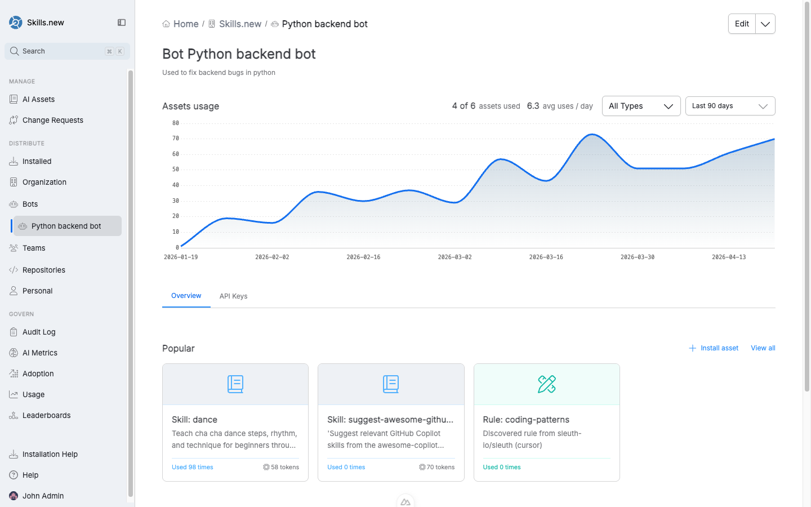

# Bots

A **bot** is a non-human principal in Sleuth Skills — a service account that can be a member of teams and have assets installed against it. Bots exist so autonomous agents (CI loops, scheduled cleanup jobs, code-review workers) can pick up the same curated asset set your engineers use, without borrowing a real person's credentials.

<figure><figcaption>
The Bot detail view — usage chart, tabs for Overview and API Keys, and the set of teams the bot belongs to.
</figcaption></figure>

## Creating a bot

Click **Bots** in the left nav and choose **Create new bot**, or ask the home-page assistant ("new bot"). You'll provide:

* **Name** — a short identifier. Converted to a slug that must be unique within the organization.
* **Description** — one line on what the bot is for (e.g. "Used to fix backend bugs in python").

Bots start in **Active** status and are ready to use immediately.

## API keys

Bots authenticate via API keys. Each bot can hold multiple keys so you can rotate them without downtime.

Open the bot's **API Keys** tab to manage keys:

* **Create** — issues a new key. The full token is shown **once** at creation time — copy it into your secret manager immediately. Afterward, only a prefix and suffix are stored for identification.
* **Delete** — invalidates a key. In-flight requests using that key will fail on next call.
* **Label** — an optional human-readable label so you can tell `ci-worker-prod` apart from `ci-worker-stage`.

The token is a standard OAuth2 access token with full scope for the bot's organization.

## Adding a bot to a team

Bots join teams the same way users do. On the team page, use **Add member** and select the bot from the dropdown. Once added, every asset installed to that team resolves for the bot, so its CI run or agent loop picks up the same skills and rules the humans on the team use.

This is the recommended pattern: don't install assets directly onto a bot unless the bot has a truly unique need. Put the bot on the teams that describe its role, and let team membership drive the asset set.

## Installing directly to a bot

You _can_ install an asset directly to a bot — useful for one-off bot-specific tools. From the bot's page, click **Install asset**. Direct bot installs are separate from team-membership installs and are recorded as their own entries in the audit log.

## Bot vs personal scope

A bot is **not** the same as a personal install. Personal scope is for a human engineer's own machine; bot scope is for a service account that can run unattended anywhere. Bots have API keys; personal scope does not.

## Usage tracking

The bot detail page shows a usage chart (assets invoked per day) and metrics like `1 of 6 assets used` and `0.3 avg uses / day`. This is the fastest way to see whether a bot is actually exercising the skills it has access to — a sign that either the bot is picking the wrong assets, or the assets don't fit the bot's workload.

## Deleting a bot

Deleting a bot invalidates all its API keys and clears any bot-scoped installs. Team memberships are removed automatically.
