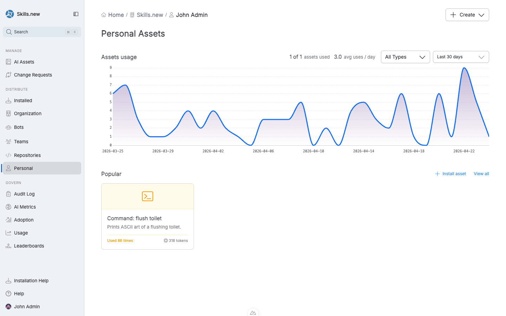

# Personal

A **personal** install is scoped to a single user — you. It writes to your global client directory but is invisible to your teammates. Use personal scope for two things: iterating on an asset before you're ready to share it, and keeping tools that only make sense for you (shortcuts, personal preferences) out of everyone else's context.

<figure><figcaption><p>The Personal Assets page shows what's installed just for you.</p></figcaption></figure>

## What lives here

The **Personal** entry in the left nav shows:

* Assets installed only to you.
* Aggregate usage for those assets (assists you decide whether a personal install is worth promoting to team or org scope).
* A **Popular** section with the assets you use most.

## Installing for yourself

From an asset's detail page, click **Install asset** and pick the personal target. The CLI equivalent:

```bash
sx install my-skill --user you@example.com
```

Two important constraints:

* **Self-only.** You can only target yourself. `sx` rejects a `--user` install that doesn't match the caller's git identity — this prevents someone with write access to the vault from silently flipping an asset to "global" in a teammate's resolved lock file.
* **Resolves to the user's global directory.** A personal install behaves like an org install for _you specifically_: it lands in `~/.claude/` so you see it in every project.

## Promoting a personal asset

Most personal assets don't stay personal forever. The typical lifecycle:

1. **Personal install** while you iterate on the prompt, test the asset, and refine its description.
2. **Team install** once you've shown it works for a role or a specific group.
3. **Org install** when it's clear the whole org benefits.

Promoting means changing the install target, not re-publishing the asset. Open the asset, click **Install asset**, and pick the new target. The old personal install is cleared in the same transaction; the audit log records both events.

## Installed vs Personal

The **Installed** entry in the left nav and the **Personal** entry look similar but answer different questions:

* **Installed** shows everything that applies to _you on this machine_ — including your org, team, and repository installs. It's the full picture of your context.
* **Personal** shows only assets installed specifically to your user scope. It's a strict subset of Installed.

Use Installed to audit your effective set; use Personal to manage what only you see.
