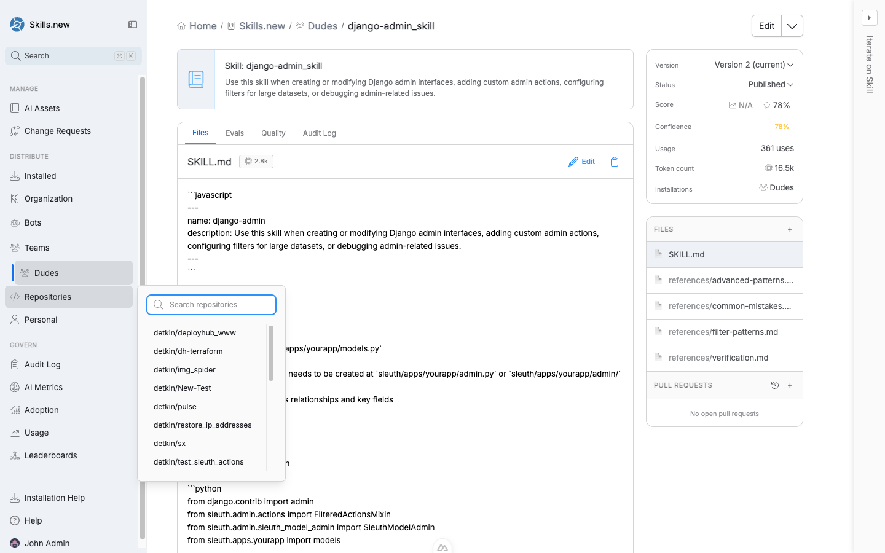

# Repositories

A **repository** installation target binds an asset to a specific git repository. When `sx install` runs inside a clone of that repo, the asset is written to the repo's local client directory (e.g. `<repo>/.claude/`). When you work in any other project, the asset is not installed — it stays out of your context.

<figure><figcaption><p>The Repositories popover in the left nav shows every repo connected to your organization. Click one to see its assets and usage.</p></figcaption></figure>

## When to use a repository install

* The asset is about _one codebase_: a skill that explains your Django admin patterns, a rule enforcing internal import conventions, an MCP server that hits your staging database.
* You want the asset out of global client context when engineers are working on unrelated projects.
* You're shipping an asset tied to a specific tech stack.

## Installing to a repository

From any asset's detail page, click **Install asset** and choose a repository. You can attach the same asset to multiple repos.

The CLI equivalent is:

```bash
sx install my-skill --repo github.com/myorg/myapp
```

Repositories in Sleuth Skills are identified by their normalized remote URL (e.g. `github.com/sleuth-io/sleuth`). When `sx install` runs, it resolves the current repo from `git config --get remote.origin.url` and matches against that identifier.

## Path-scoped installs

Monorepos often have multiple projects under one git root. To scope an asset to a _subtree_ of a repo, use path scoping:

```bash
sx install my-skill --path github.com/myorg/myapp#services/api
```

With this installed, the asset only appears when `sx install` runs under `services/api/` within the repo. Clients see it in `services/api/.claude/`, not at the repo root.

You can list multiple paths in one install:

```bash
sx install my-skill --path github.com/myorg/myapp#services/api,services/web
```

Path scopes are the sharpest tool in the monorepo toolbox — they keep the API team's prompts out of the web team's context even though both teams work in the same git root.

## Repository vs team scope

When several teams share a repo, either scope can work. Use the one that matches intent:

* **Repository scope** if the asset is about _the code in this repo_. Example: a skill that knows your internal patterns. Everyone who clones the repo gets it.
* **Team scope** if the asset is about _the people who work in this repo_. Example: a review rule the Platform team applies to every repo they own. Only team members get it, and they get it in all team repos.

Repository scope is broader (anyone who clones) but bounded to one codebase; team scope is narrower (only team members) but spans all team repositories.

## Disconnecting a repository

Removing a repository from your organization detaches any active installs that targeted it. An `install.cleared` audit event is emitted for each affected asset.
