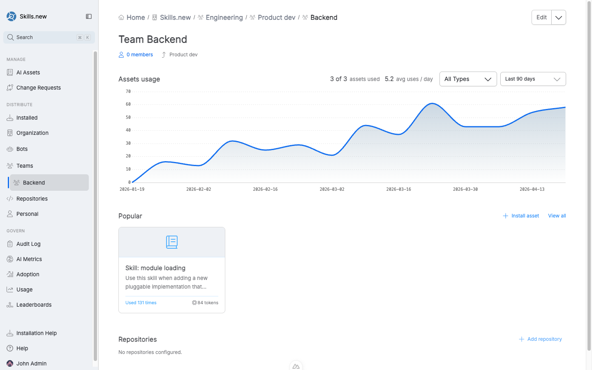

# Teams

A **team** in Sleuth Skills is a named group that contains three things:

* **Members** — users in your organization.
* **Bots** — service accounts that can be assigned the same assets as human members.
* **Repositories** — git repositories whose assets are flattened out to each member when `sx install` runs.

Teams are how you route assets to a role or a group without hand-managing every individual user.

<figure><figcaption>
The Team detail view — usage chart, popular assets, members, and configured repositories. Teams can nest.
</figcaption></figure>

## Creating a team

Open the **Teams** entry in the left nav and click **Create new team**, or use the home-page assistant ("new team"). You'll be prompted for:

* **Name** (required).
* **Description** — a short sentence so teammates know what the team is for.
* **Members** — the users who belong. At least one admin is required at all times; if you're creating the team, you'll be added as a member and admin automatically.
* **Repositories** — the codebases this team owns.

## Team admins

Every team has one or more **admins**. Admins can add and remove members, change repositories, install assets to the team, and delete the team itself. Regular members can view the team but not modify it.

A mutation that would leave the team with zero admins is rejected; you must promote another admin before removing or demoting the last one.

## Installing to a team

From any asset's detail page, click **Install asset** and pick a team. Alternatively, from the team's page, use **Install asset** in the Popular section.

When `sx install` runs, a team-scoped asset is resolved against the caller's identity:

* If the user is a **member** of the team, the asset is expanded to installs for each of the team's **repositories**. The user gets the asset in any of those repos' `.claude/` directories.
* If the user is **not a member**, the team install is ignored.

This means team installs are repository-aware: a Backend team with three repos will install the team's `api-patterns` skill into each of those three repos for each member, without touching anyone else's projects.

## Adding a bot to a team

Bots can join teams the same way users do. When a bot is a member, any team-scoped install also resolves for that bot. This is how agent loops pick up the same curated asset set humans use without a separate installation flow.

See [Bots](bots.md) for the full bot lifecycle.

## Nested teams

Teams can nest inside other teams. The breadcrumb on a team page shows the full chain — e.g. `Skills.new / Engineering / Product dev / Backend`. Nested teams inherit parent membership for asset resolution, which makes it natural to model your org chart without duplicating installs.

## Deleting a team

Deleting a team cascades: every team-scoped install that references it is automatically cleared, and an `install.cleared` audit event is emitted for each affected asset with `reason = "team_deleted"` so auditors can reconstruct why an asset stopped installing.

## Identity and admin gating

Team membership, admin checks, and asset installs all key off the email from your authenticated session. On the CLI side, `sx` uses `git config user.email` and enforces admin checks inside the vault mutation transaction — not just client-side — so a concurrent demotion cannot race past the pre-check.
