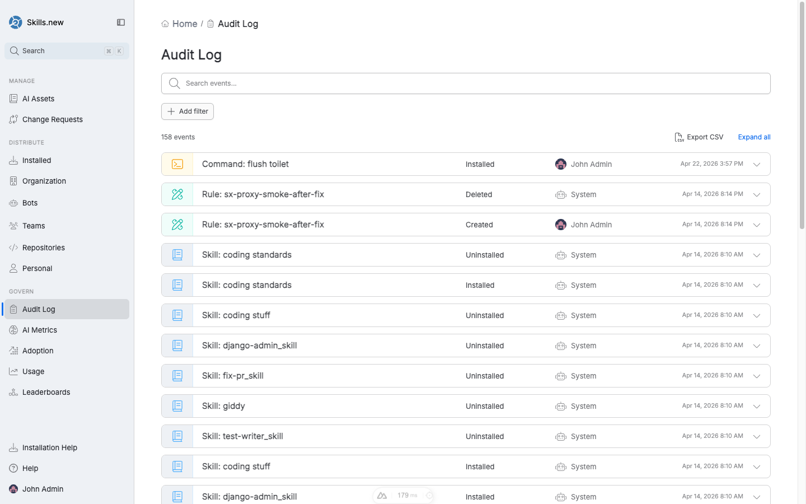

# Audit log

The **Audit Log** records every state-changing action in your Sleuth Skills vault. It is append-only: entries cannot be edited or deleted, and the write path is inside the same transaction that mutates state, so if the audit write fails the mutation is the one that rolls back.

<figure><figcaption><p>The Audit Log — every install, uninstall, and team change is a row. Filters narrow by event type, actor, target, or date range.</p></figcaption></figure>

## What gets logged

The following events are recorded:

| Event | Target type | Target | Captured data |
|-------|-------------|--------|---------------|
| `team.created` | team | team name | `description`, `members`, `admins`, `repositories` |
| `team.updated` | team | team name | _(replaces whole team body)_ |
| `team.deleted` | team | team name | _(none)_ |
| `team.member_added` | team | team name | `member`, `admin` flag |
| `team.member_removed` | team | team name | `member` |
| `team.admin_set` | team | team name | `member` |
| `team.admin_unset` | team | team name | `member` |
| `team.repo_added` | team | team name | `repository` |
| `team.repo_removed` | team | team name | `repository` |
| `install.set` | installation | asset name | `kind`, plus one of `repo` / `paths` / `team` / `user` |
| `install.cleared` | installation | asset name | `kind`, `reason` (e.g. `team_deleted`) |

Asset publications, bot lifecycle changes, and API-key operations are logged with analogous events.

## Cascade events

Some mutations trigger automatic follow-up events:

* Deleting a **team** emits one `install.cleared` per team-scoped asset that referenced it, with `reason = "team_deleted"`.
* Disconnecting a **repository** emits one `install.cleared` per repo-scoped asset.
* Deleting a **bot** clears bot-scoped installs and invalidates its API keys.

Cascades are what make the audit log a reliable incident-reconstruction tool: you can always explain why an asset stopped resolving without a separate "why did this happen" investigation.

## No-op skipping

Repeating a mutation that already matches the current state is a silent no-op: no audit event is emitted. Re-adding a team member who is already on the team, granting admin to someone who already has it, or re-installing an asset with its current scope all produce zero audit events. This keeps the log free of churn from idempotent retries — you can safely re-run scripts without flooding history.

## Querying the log

In the UI, the Audit Log page supports:

* **Full-text search** across event descriptions.
* **Add filter** for event type, actor (user or bot), target (asset / team / repo), and date range.
* **Expand all** to show the detailed payload for each event.
* **Export CSV** for the filtered view.

From the CLI:

```bash
sx audit                                    # last 7 days
sx audit --since 30d                        # widen the window
sx audit --since all                        # whole log
sx audit --actor alice@acme.com             # one actor
sx audit --event install.set                # one event type
sx audit --target code-reviewer             # one asset / team
sx audit --since 7d --json                  # machine-readable
sx audit --limit 20                         # cap output
```

Filters are AND-combined: `--actor alice@acme.com --event install.set --target code-reviewer --since 30d` returns only the set where all four conditions hold.

## Storage format

The CLI exposes the same JSONL format the vault writes internally. Each line is a self-contained JSON object:

```json
{
  "ts": "2026-04-17T10:04:12.445Z",
  "actor": "alice@acme.com",
  "event": "install.set",
  "target_type": "installation",
  "target": "code-reviewer",
  "data": { "kind": "team", "team": "platform" }
}
```

For git and path vaults, events land in `.sx/audit/YYYY-MM.jsonl` under the vault root. For the Skills.new hosted vault, events are written to the server's audit store and retrieved via the same `sx audit` commands.

## Compliance considerations

The audit log is designed to be the authoritative record for:

* **Security reviews** — who installed what hook, when, and on which target.
* **Incident response** — reconstructing the installed asset set at a past moment.
* **Access reviews** — who currently has admin on which teams, and when they were promoted.

Treat the log as evidence: retain it per your company's policy, export regularly, and do not modify the underlying store. The append-only guarantee is enforced at the write layer (vault flock for local vaults, transactional insert for Skills.new).
