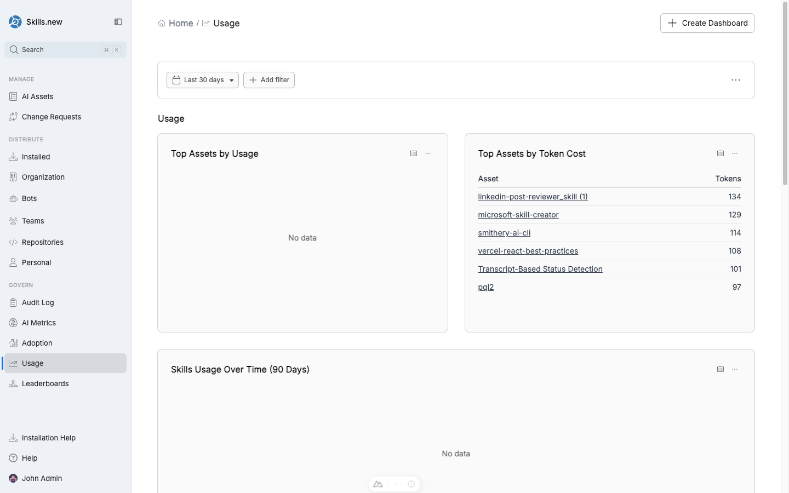
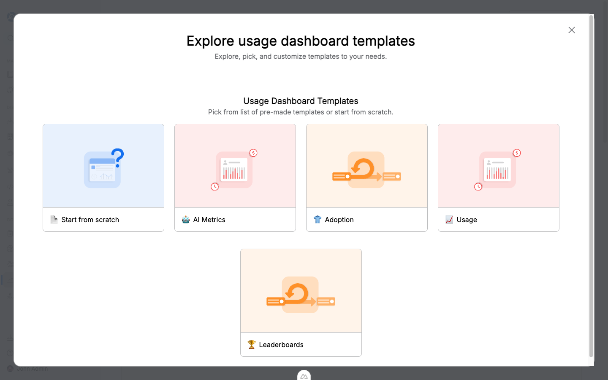

# Usage metrics

Publishing assets is the easy part; knowing whether anyone is using them is where real governance kicks in. Sleuth Skills captures a usage event every time an installed asset runs, and rolls those events into four pre-built dashboards — **AI Metrics**, **Adoption**, **Usage**, and **Leaderboards** — plus a custom-dashboard builder for questions the defaults don't answer.

<figure><figcaption><p>The Adoption dashboard — new users over time, user adoption percentage, and repo/team adoption breakdowns.</p></figcaption></figure>

## The four default dashboards

| Dashboard | Question it answers |
|-----------|---------------------|
| **AI Metrics** | High-level KPIs: total invocations, token cost, human vs bot, trend over time. |
| **Adoption** | What percentage of your users, teams, and repositories have any usage in the window? Who has newly adopted? |
| **Usage** | Which assets are used most (by count and by token cost)? What's the raw volume over time? |
| **Leaderboards** | Ranked lists — top assets, top actors, top teams. |

Each dashboard defaults to the last 30 days; use the date range and **Add filter** controls to narrow.

## What counts as a usage event

`sx` records a usage event every time it installs an asset. Clients that integrate with `sx` (Claude Code, Cursor, and others per the compatibility matrix) emit events when an installed asset runs — a skill loading in a session, a command being invoked, an MCP tool call, a hook firing.

Each event carries:

```json
{
  "ts": "2026-04-17T10:04:12.445Z",
  "actor": "alice@acme.com",
  "asset_name": "code-reviewer",
  "asset_version": "1.2.3",
  "asset_type": "skill"
}
```

Asset-specific payloads add extra fields — for example, `tool_name`, `duration_ms`, and `success` on MCP tool-call events.

## What the dashboards show

<figure><figcaption><p>The Usage dashboard — top assets by usage and by token cost, plus a time series.</p></figcaption></figure>

**Adoption metrics:**

* **User adoption** — what percentage of org members had any recorded usage in the window.
* **Team adoption** — same breakdown per team (e.g. `platform 3/5 = 60%`).
* **Repository adoption** — how many connected repos had any `sx install` run during the window.
* **New user adoption over time** — first-time adopters per day.

**Usage metrics:**

* **Top assets by usage** — raw invocation count per asset.
* **Top assets by token cost** — cumulative tokens consumed, useful for cost attribution.
* **Skills / Agents / Commands usage over time** — time series, filterable by type.
* **Top actors** — humans and bots ranked by invocations.

**AI metrics:**

* Bot-vs-human split.
* Token cost trend.
* Invocation volume by asset type.

## Filtering and drill-down

Every widget respects the page-level filters (date range, asset type, team, repository, user). Clicking a row in a leaderboard or a segment in a chart drills into the underlying filter — click the Backend team's adoption number and the dashboard rescopes to that team's activity.

## Custom dashboards

The four default dashboards answer the most common questions, but most teams eventually want to slice usage their own way. Click **Create Dashboard** in the top-right of any dashboard page to build your own.

<figure><figcaption><p>The Create Dashboard picker. Start from a blank canvas or clone one of the four preset templates.</p></figcaption></figure>

You pick one of five starting points:

| Template | Starts you with |
|----------|-----------------|
| **Start from scratch** | A blank canvas. Add widgets one at a time. |
| **AI Metrics** | Copy of the AI Metrics dashboard — KPIs, bot-vs-human, token cost trend. |
| **Adoption** | Copy of the Adoption dashboard — user/team/repo adoption + newcomers. |
| **Usage** | Copy of the Usage dashboard — top assets by usage and token cost, time series. |
| **Leaderboards** | Copy of the Leaderboards dashboard — ranked assets, actors, teams. |

Every widget is backed by a PQL query (the Sleuth Skills query language for usage data), so the cloned dashboards are fully editable: rename widgets, change time windows, add filters, or swap the underlying query entirely.

### AI-generated widgets

You can also add widgets by asking the assistant. Describe what you want — "a chart showing MCP tool-call duration by bot over the last 90 days" — and the assistant researches what's available in your usage data, writes the PQL, and creates a persistent widget on your dashboard. The widget keeps the generated query so it re-runs automatically whenever the dashboard loads — it's a real widget, not a one-off answer.

This is the fastest way to prototype a new dashboard: start from a preset, ask the assistant for the two or three custom widgets you're missing, and save.

## CLI access

The same data is available via `sx stats`:

```bash
sx stats                               # last 7 days
sx stats --since 30d                   # widen the window
sx stats --since all                   # lifetime totals
sx stats --assets                      # per-asset view only
sx stats --teams                       # per-team view only
sx stats --since 30d --json            # machine-readable
```

`sx stats --json` returns:

```json
{
  "since": "2026-03-18T00:00:00Z",
  "total_events": 127,
  "assets": [
    { "AssetName": "code-reviewer", "TotalUses": 42, "UniqueActors": 17 }
  ],
  "teams": [
    { "name": "platform", "member_count": 5, "active_members": 3, "adoption_pct": 60.0 }
  ],
  "top_actors": [
    { "Actor": "alice@acme.com", "TotalUses": 9 }
  ]
}
```

Use this in CI or scheduled jobs to pull weekly adoption snapshots into Slack, BI tools, or a nightly digest.

## Fault tolerance

Usage events are best-effort: a malformed event line is logged and skipped so one bad event doesn't drop a batch of good ones. Events with unparseable timestamps are stamped with the Unix epoch so they fall outside recent-window filters rather than skewing them; `--since all` still counts them.

For git vaults, usage events flush lazily — they ride along with the next management commit rather than generating one commit per install, which keeps history clean without losing durability across CLI runs. The Skills.new hosted vault ingests events synchronously through its usage endpoint.
