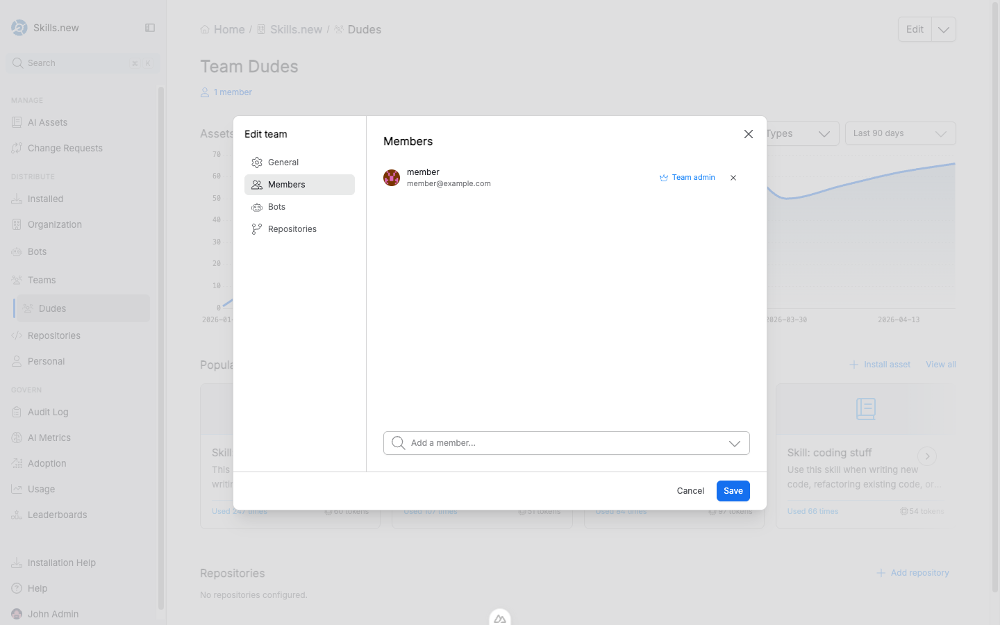
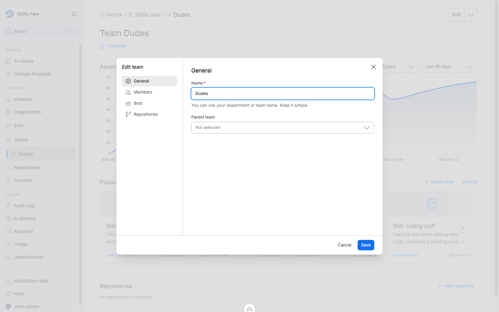

# RBAC

Sleuth Skills ships with a small, pragmatic role model designed around a simple question: _who can change what, and when does a change need a second pair of eyes?_

There are two places a role is assigned — at the **organization** level and at the **team** level — and both feed the same change-request approval flow.

## The roles

### Global admin

A **global admin** is assigned at the organization level and has full permissions across every team, repository, bot, and asset in the vault.

A global admin can:

* Create, edit, and publish any asset in any team without going through a Change Request.
* Approve any open Change Request or installation request.
* Create, rename, and delete teams.
* Create, configure, and delete bots. Rotate bot API keys.
* Connect and disconnect repositories.
* Change any member's organization role.
* Install any asset to any target (org, team, repo, bot, personal).

Org settings you see in the left nav (inviting members, managing repositories, etc.) are gated on this role.

### Team admin

A **team admin** is a member of a specific team whose membership has the admin flag set. Team admins have authority _within that team's scope_ — members, repositories, and any asset installed to the team — but not across the organization.

A team admin can:

* **Approve Change Requests** raised against assets their team owns or has installed.
* **Approve installation requests** that target their team.
* Add, remove, and rename team members.
* Add and remove team repositories.
* Install team-owned assets to the team or to the team's repositories.
* Promote other team members to team admin, or demote them back.

A team admin cannot change other teams, the organization's global settings, or anyone's organization-level role.

Team admins are the most common "reviewer" role in practice — they're the people approving day-to-day edits from their own teammates without needing a global admin in the loop.

<figure><figcaption>
The Edit team → Members tab. The "Team admin" badge next to a member's email marks them as a reviewer for that team's Change Requests and installation requests.
</figcaption></figure>

### Member

A **member** is the default role for everyone in the organization. Members can:

* **Create new assets** (as drafts).
* **Edit drafts they own** without approval.
* **Request edits to published assets** — this opens a Change Request that a team admin or global admin must approve.
* **Request an installation** of any asset to a target — this opens an installation request that an admin must approve before it applies.
* **View the audit log** and usage metrics (read-only).

Members cannot install assets directly, delete teams, or approve anyone else's changes.

## The Change Request flow

When a member edits a published asset, the system does not merge the change immediately. Instead it creates a **Change Request** — a structured PR-style object with the new files, a diff, an optional comment thread, and a `requires_approval` flag.

A Change Request moves through these states:

1. **Open** — created by the member; visible to the team's admins and global admins.
2. **Approved** — a team admin (or global admin) reviews and approves. The change is eligible to merge.
3. **Merged** — the new version becomes the published version of the asset. The audit log records the transition.
4. **Rejected** — the reviewer declines. The member can update and re-submit.

If no team admin exists for the asset's owning team, the Change Request waits for a global admin. This is the one case where the flow can stall — set at least one team admin per active team so day-to-day review doesn't escalate to the org level.

The same flow applies to **installation requests**. A member who wants to install an asset to a team or a repository raises a request; a team admin (for team-targeted installs) or global admin approves it; `sx install` then picks it up on the next run.

## When is approval required?

| Action | Member | Team admin | Global admin |
|--------|--------|------------|--------------|
| Create a new draft asset | ✅ Direct | ✅ Direct | ✅ Direct |
| Edit a draft you own | ✅ Direct | ✅ Direct | ✅ Direct |
| Edit a published asset | Requires approval | ✅ Direct | ✅ Direct |
| Install to a team | Requires approval | ✅ Direct (own team) | ✅ Direct |
| Install to a repository | Requires approval | ✅ Direct (team's repos) | ✅ Direct |
| Install org-wide | Requires approval | Requires approval | ✅ Direct |
| Install to a bot | Requires approval | ✅ Direct (team's bots) | ✅ Direct |
| Install personal (self only) | ✅ Direct | ✅ Direct | ✅ Direct |
| Create / rename / delete a team | ❌ | ❌ | ✅ |
| Add / remove team members | ❌ | ✅ (own team) | ✅ |
| Promote a team admin | ❌ | ✅ (own team) | ✅ |
| Approve a Change Request | ❌ | ✅ (own team) | ✅ |
| Create / delete a bot, rotate API keys | ❌ | ❌ | ✅ |

**Personal installs** are always self-serve — any member can install an asset for themselves. The system enforces that the user scope matches the caller's identity, so a member cannot use this route to install assets for teammates.

## How roles are assigned

Global admin is granted from **Organization settings** by an existing global admin.

Team admin is granted from a team's page: open the team, click **Edit** in the top-right, switch to the **Members** tab, and toggle the **Team admin** badge next to the relevant member. Bot members of a team cannot be admins.

<figure><figcaption>
The Edit team dialog opens from the Edit button on the team page. Use the tabs on the left to switch between General, Members, Bots, and Repositories.
</figcaption></figure>

Every role change — promotion, demotion, removal — is recorded in the [Audit Log](../govern/audit-log.md).

## Keeping the flow healthy

Three small habits keep the approval flow from becoming friction:

1. **Every active team has at least one team admin.** Otherwise Change Requests pile up waiting for a global admin.
2. **Prefer team-scoped installs over org-wide.** Org-wide installs require global-admin approval; team installs stay inside the team.
3. **Review Change Requests within a day.** The longer a CR sits open, the more likely the member has moved on and the edit goes stale.
