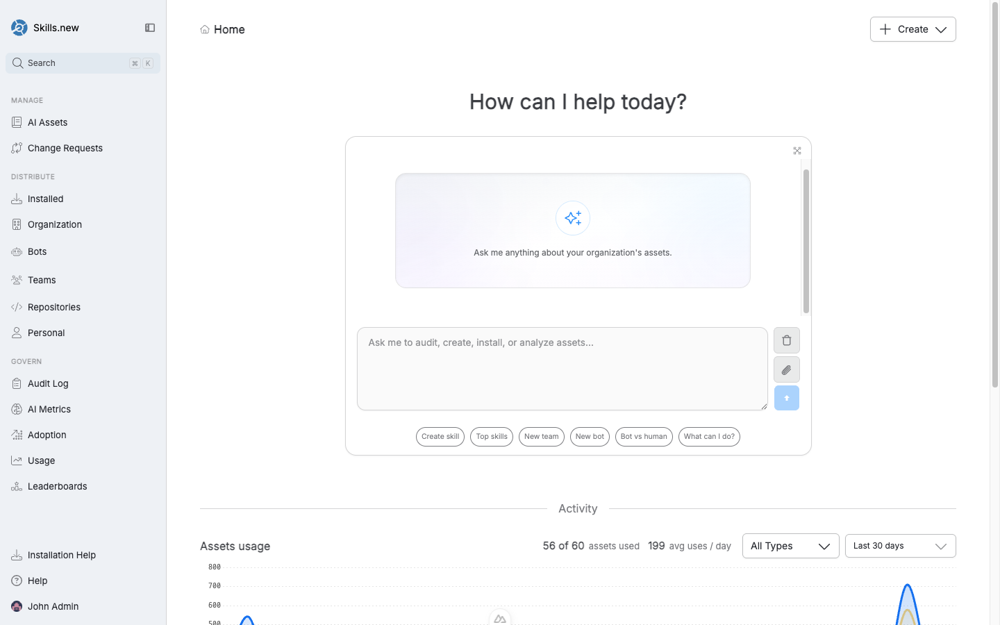
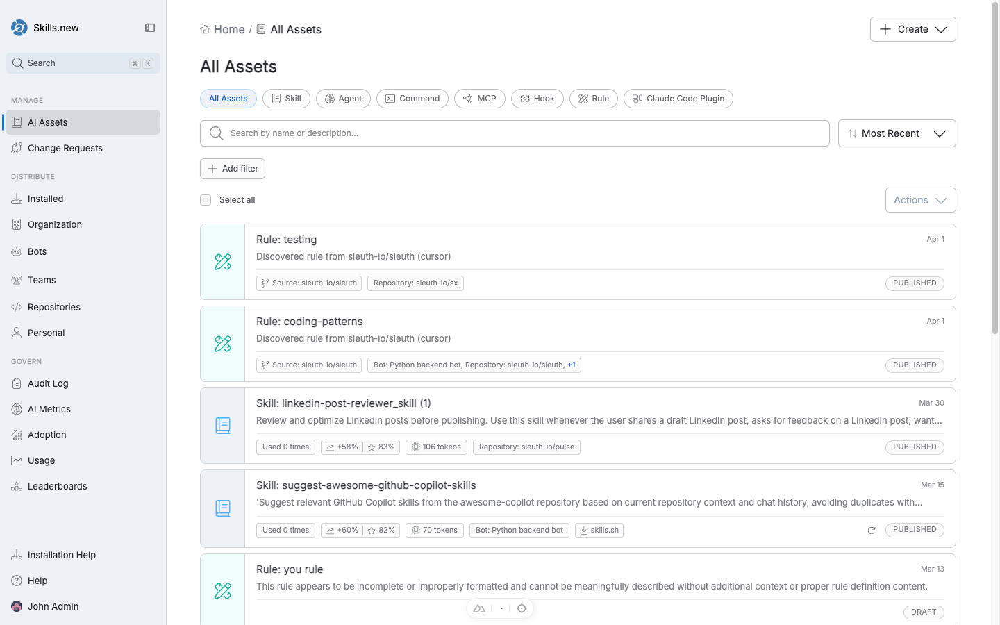
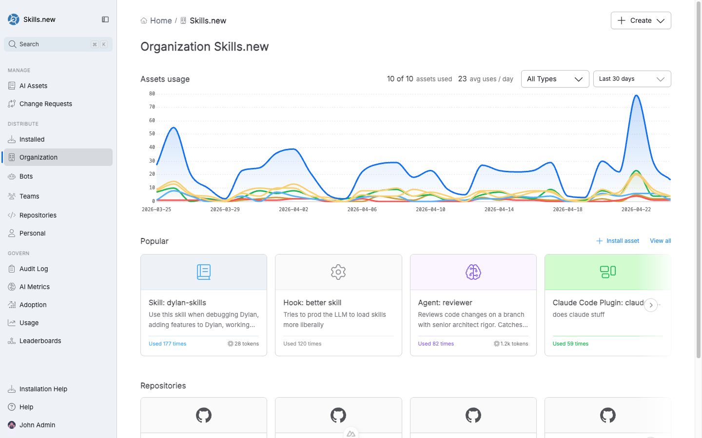
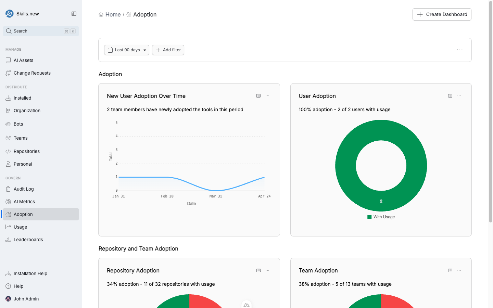

# Quick Start Guide

This guide walks you through the end-to-end loop: create an account, wire up the `sx` CLI, publish an asset, install it to a target, and see it show up in a Claude Code (or any other supported client) session.

## 1. Set up your account

1. Go to [skills.new](https://skills.new) and sign in with Google, GitHub, SAML, or an existing Sleuth DORA account.
2. On first login, Sleuth Skills creates an **Organization** for you. Everything in the product — assets, teams, repositories, bots, audit events — is scoped to one organization.
3. Invite teammates from the **John Admin → Organization** menu. Anyone you invite can sign in and start consuming assets immediately; admin actions like creating teams or publishing org-wide installs are gated by role.

<figure><figcaption><p>After sign-in, the home page shows recent activity and a natural-language assistant for discovering, creating, and auditing assets.</p></figcaption></figure>

## 2. Install the `sx` CLI

Skills.new is the hosted vault; [`sx`](https://github.com/sleuth-io/sx) is the command-line runtime that distributes assets onto developer machines. You need both: the UI to manage and govern, the CLI to install.



```bash
brew tap sleuth-io/tap
brew install sx
```



```bash
curl -fsSL https://raw.githubusercontent.com/sleuth-io/sx/main/install.sh | bash
```



Then point `sx` at your Sleuth Skills vault:

```bash
sx init --type sleuth
```

This stores an auth token under `~/.config/sx/` and registers the vault so that `sx install` and `sx add` know where to talk to.

## 3. Understand asset types

Every artifact you publish to Sleuth Skills is an **asset** with a type. Each type targets a different part of the AI client's configuration surface.

| Type | What it is | Example |
|------|------------|---------|
| **Skill** | A named capability with a prompt, metadata, and optional bundled files. Triggered by the model when its description matches. | `django-admin_skill` — how to scaffold Django admin pages. |
| **Rule** | Coding standards or constraints that auto-apply based on file path or project context. | `testing` — always use pytest with fixtures; mock externals with vcrpy. |
| **Agent** | A self-contained autonomous worker with a goal. | `reviewer` — reviews a branch with senior-architect rigor. |
| **Command** | A slash command the user invokes explicitly. | `/flush-toilet` — prints ASCII art. |
| **Hook** | Automation triggered by client lifecycle events (pre-prompt, post-tool-use, etc.). | `hi` — logs a greeting to `log.txt`. |
| **MCP server** | A Model Context Protocol server definition the client launches. | `hi-dylan` — returns "Hi Dylan!". |
| **Claude Code plugin** | A bundle of skills, commands, hooks, and MCP configs shipped as a single unit. | `claude-code-plugins` — team-wide plugin bundle. |

Each type has its own definition format. See [Manage](manage/README.md) for the full breakdown.

## 4. Discover existing assets

Before creating anything new, it's worth seeing what is already published in your org (and what's available in the wider community).

<figure><figcaption><p>The AI Assets list, filtered by type. Each row shows usage count, token cost, and publication status.</p></figcaption></figure>

* **In the UI:** click **AI Assets** in the left nav. Filter by type (Skill, Agent, Command, MCP, Hook, Rule, Claude Code Plugin), by source (which repo it was discovered from), or search by name.
* **From the CLI:** run `sx add --browse` to search [skills.sh](https://skills.sh), a community directory of 85k+ agent skills, and pull one into your vault.

## 5. Create your first asset

The fastest way is the home-page assistant — type a goal and it will draft the asset, ask you a few clarifying questions, and save it as a draft in **AI Assets**. You can also create directly from the **Create** button in the top-right of any page, or via `sx add /path/to/your-skill` from the CLI.

Once saved, an asset starts in **Draft**; publish it when you're ready for teammates to see it.

## 6. Pick an installation target

An asset exists as a definition until you _install_ it somewhere. Installation targets are the domain model Sleuth Skills uses to answer "who gets this asset?":

<figure><figcaption><p>The Organization view — the root container for every asset, team, bot, and repository in your Sleuth Skills vault.</p></figcaption></figure>

* **Organization** — everyone in the vault.
* **Teams** — a group of members and repositories; installs cascade to all members and repos on the team.
* **Repositories** — a specific git repo; installs apply only when `sx install` runs inside a clone of that repo.
* **Bots** — service accounts that can be added to teams and installed against directly.
* **Personal** — an individual user; they can install their own assets globally without affecting anyone else.

See [Distribute](distribute/README.md) for the detailed semantics.

## 7. Distribute and verify

From an asset's detail page, click **Install asset** and pick a target. `sx` resolves the install set on the next run:

```bash
cd ~/src/myproject
sx install
```

To preview what would be installed for the current repository and your git identity without actually writing anything, run:

```bash
sx install --dry-run
```

A successful install shows one line per asset in the form `name==version  # type; scope=...`. The asset is now on disk in the right client directory (e.g. `.claude/skills/`) and will be available the next session.

## 8. Govern adoption

Once assets are running, the **Govern** section in the left nav tells you whether anyone actually uses them.

<figure><figcaption><p>The Adoption dashboard — new users over time, team-level and repository-level adoption rates.</p></figcaption></figure>

* **Audit Log** — every install, uninstall, team change, and asset publication. Exportable as CSV.
* **AI Metrics / Adoption / Usage / Leaderboards** — pre-built dashboards for common questions. You can clone any of them into a custom dashboard.

## What next?

* Wire a [team](distribute/teams.md) so new joiners inherit the right assets automatically.
* Add a [bot](distribute/bots.md) so CI or an agent loop gets its own curated asset set.
* Set up [scope filters](distribute/repositories.md#path-scoped-installs) for a monorepo.
