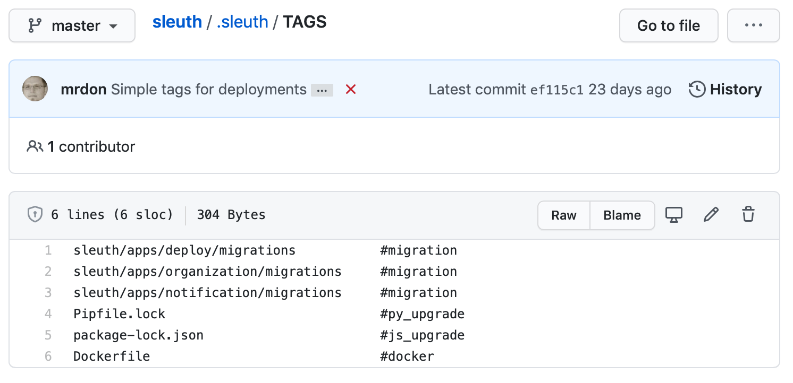
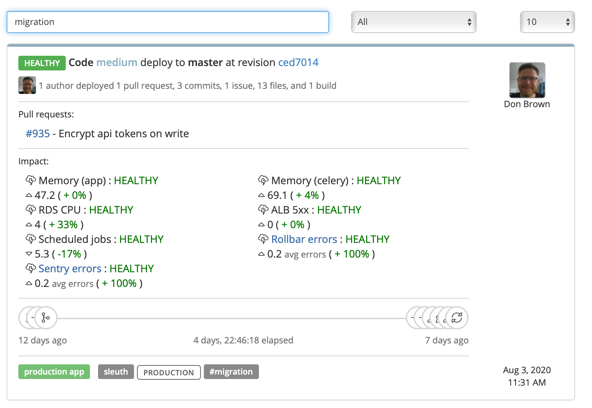

# Automatic Tags

Sleuth tags are automatically added to your deploys so that you can quickly search for them later. The tags are added by looking for patterns in the files deployed in your code repositories. For example, if Sleuth finds a **pom.xml** file in your deploy, it automatically adds the tag **\#dependencies** to the deploy. You can then go to the [Dashboard](dashboard/) and search for **dependencies** using the search function. See the table below for more patterns and tags Sleuth automatically applies to your deploys based on pattern matching. 

For comparison, GitHub tags point to an invidual commit. They're similar to references, but the commit it points to never changes. They're helpful if you want to, say, point to specific release, which is at a specific point in time. So keep this in mind: **Sleuth tags are not the same as GitHub tags**.  

If tags are not explicitly defined for a deployment, Sleuth detects tags by matching files using patterns either from the _**.sleuth/TAGS**_  file in your repository , or a set of default patterns:

| Pattern | Tag |
| :--- | :--- |
| \*\*/migration/\*\* | \#migration |
| Pipfile.lock | \#dependencies |
| requirements.txt | \#dependencies |
| package-lock.json | \#dependencies |
| pom.xml | \#dependencies |
| Dockerfile | \#docker |
| \*\*/db/\*\* | \#database |
| \*tf | \#terraform |

### Searching for tagged deploys

You can search for tags using the search bar in the Sleuth Dashboard. 

1. Go to the Dashboard. 
2. Enter the tag name you're searching for in the search field. **Do not enter the leading hash** \(**\#**\). Results are displayed automatically. Use the dropdowns next to the search field to filter by deploy health and results per page. 

Deploys that contain the tag are displayed. In the example below, deploys that contain the pattern \*\***/migration/\*\***  are displayed in the search results. The tag **\#migration** is displayed in the tag section at the bottom of the deploy card. 

### Adding custom tags

In addition to having Sleuth automatically detect patterns and add tags to your deploys, you can add your own patterns that Sleuth can then use to help you search for your previous deploys. This is easily done by editing the _**.sleuth/TAGS**_ in your code repository. 

#### To add your own pattern/tag pair: 

1. Create a _**.sleuth/**_ directory in the root directory of your repo. This repo must be connected as a [code deployment](settings/project-settings/code-deployments.md) in Sleuth. 
2. Create a file **TAGS** in the _**.sleuth**_ directory. 
3. Create a matching pattern/tag pair; create additional pairs on new lines.  For example: `/db #database`
4. Save the file. 

In the example above, a directory with the name `db` would generate a tag `#database` in the Sleuth deploy card, which you can then search for quickly using the Sleuth search \(**do not** include the leading hash when searching\). 

