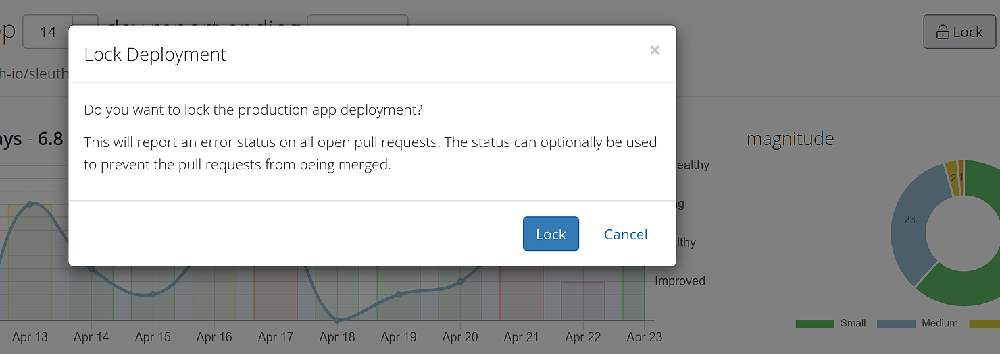
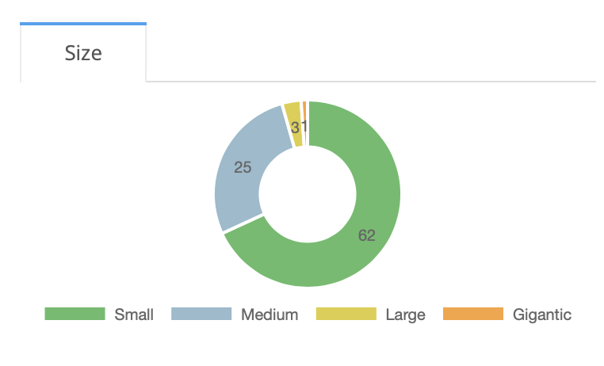

# Terminology

## Projects

**Projects** are the main entities in Sleuth. They house your code deployments, feature flags, impact sources, and any manual changes you configure. Think of them as the application you're deploying.  

## Code deployment

**Code deployments** track changes made via source code and the software development surrounding the change. Each deploy collects the **code reviews, issues, code changes and authors** of the change being deployed to your systems. Code can live on either [GitHub](integrations-1/change-sources/code-deployment/github.md) or [Bitbucket](integrations-1/change-sources/code-deployment/bitbucket.md) repos. 

## Feature flags

Sleuth tracks **feature flags** changes in [LaunchDarkly](integrations-1/change-sources/feature-flags/launchdarkly.md) by changing the values of feature flags. Each flag change collects the changes made, who made them, and the state of your other flags and the linked code version deployed at the time of the change. Feature flags are an integral part of software development, and Sleuth tracks them along with other metrics to provide you with a snapshot of your deployments' health. 

## Impact

The effect of your deploys over a predetermined period of time. As you perform your commits and PRs to your code repos, Sleuth is constantly ingesting the information generated by your change sources and impact sources. The collective effect of the errors generated by all of your change sources and impact sources is what defines the **impac** \([observability](https://en.wikipedia.org/wiki/Observability) and [SLI](https://en.wikipedia.org/wiki/Service_level_indicator) are similar terms used in software development\). Sleuth detects when the impact value has deviated from “normal” and keeps you posted on this deviation by constantly generating an impact metric. 

A user might want to know if a deploy has had a positive/negative/neutral impact on their project, or wants to know how impact is trending in relation to the deploys that are occurring. They want to understand if a deploy has changed the “normal” behavior of their system so they can react appropriately.

Once a commit is performed, Sleuth samples the commit at the moment of deploy, started by defining a standard deviation, and then afterwards for up to 60 minutes. The average of the errors in that time period is used to compute the impact, which is visible on the deploy card for every commit. This feature is exclusive to Sleuth, and provides you with higher-resolution feedback other than a simple👍or 👎. 

Impact is integral to the Sleuth experience, and is one of the main metrics Sleuth computes to provide you with the overall health status of your deploys. 

## Locking

 The Lock feature in Sleuth prevents pull requests from merging into main branches, and generates automatic notifications via your Chat Ops [integrations]() \(e.g., [Slack](integrations-1/chat-ops/slack.md)\). 

Read team member Don Brown's blog post on how Sleuth's locking feature can make your DevOps life happier! 

## Leaderboard

The Leaderboard provides a social component to Sleuth by endeavoring developers to deploy faster and smaller. 

**Scoring**

The score of an author is the simple sum of several metrics:

* **Deploy** - 5 points for each deploy;
* **Author** - 3 points for each deploy in which the author was involved but didn't perform the deploy;
* **Impact** - 2 points for each deploy rated 'Healthy', and 10 for each deploy rated 'Improved'.

## Size

The Size graph displays the overall size of the deploys being committed to the repo in your project. This is a quantitative way to gauge how your team is performing. Although size on its own is not a pure indication of the quality of the code your team is committing, it can help you and your team realize the goal of deploying smaller and faster. Quality still matters, of course, but maintaining smaller pieces of code and deploying more often makes it easier to scale things back if your application crashes. 

