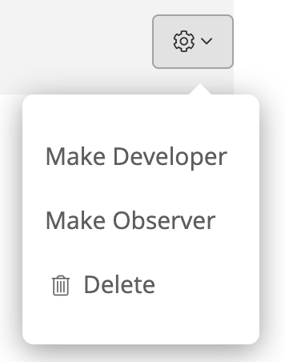

# Access Control

Sleuth uses a role-based access control \(RBAC\) method to restrict access to the Sleuth application. Every organization by default has a single owner, who can then assign roles to organization members. Depending on the given role, members within the organization can handle billing, add new members and assign roles, adjust settings for integrations and deployments, or can simply be read-only viewers of the Dashboard. 

Different roles control what parts of Sleuth your users can see and change: 

* **Owner**: The organization owner that cannot be removed. 
* **Administrator**: Can do anything. 
* **Developer**: Can add integrations, deployments, but not users. 
* **Observer**: Can view deployment information but can't change anything.

To check it out, go to **Organization Settings &gt; Members**, then select the cog dropdown next to the user to change their role:

  

Invite people in a certain role

Change roles

Domain signup enabled \(domain matchin\) we default you to the **Developer** role. Observer is someone who is generally non-technical \(marketing, executive\). 

Only One Owner per ORG; infinite number of all the other ones. No licnesein stuff based on roles. 

Be default everyone will have Admin. Owner is the person who created the Org. Anything in Org Settings only accessible by Admin/Owner.  

