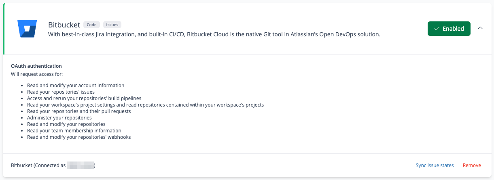

# Work in Progress

In addition to tracking deploy metrics, Sleuth also provides **Work in Progress** dashboards for Teams and Projects that provide real-time visibility into in-flight work (i.e. work that has not yet deployed) and highlights risks that you can address right now.&#x20;

<figure><figcaption>
Project Work in Progress dashboard
</figcaption></figure>

### What is "Work in Progress"?

Work in Progress, or WIP, includes any PRs or Future Deploys that have not yet deployed to their target environment (where a "Future Deploy" in Sleuth is essentially a container for PRs that have merge but have not yet deployed).&#x20;

### Understanding "at-risk" items

While the **Work in Progress** dashboards present in-flight work in part to provide general visibility into the changes that are likely deploy next, the real value of these dashboard is that they highlight "at risk" items that are likely to have a negative impact on your DORA metrics. This early risk identification allows you to take immediate corrective actions on at-risk items before they ship, driving tactical improvements to your DORA metrics.&#x20;

Sleuth currently highlights the following risk types:

* Batch Size
* Total CLT
* Coding time
* Review lag time
* Review time
* Waiting to deploy

For Batch Size, an item is considered "at risk" if it is either Large or Gigantic.

For CLT and its four composite breakdowns, an item is considered "at risk" if it's current value exceeds your "baseline" by more than 20% (where your "baseline" is calculated based on the items that _deployed_ during the same period as your currently work-in-progress data range selection). Note that an item must accumulate a minimum of 30 minutes in a given CLT bucket before Sleuth will potentially flag it as at-risk relative to your baseline.&#x20;

### Understanding Work in Progress filters

The Work in Progress dashboards provide two levels of filtering.

#### Top-level dashboard filters

Just like the Metrics Dashboards for Projects and teams, the Work in Progress dashboard can be filtered using top-level filters for Date Range, Projects, Teams, Environments, and Deployments. These filters impact the specific PRs and Future deploy that display in the listing as well as the data that is displayed in all of the dashboard charts.

<figure><figcaption>
Top-level work-in-progress dashboard filters
</figcaption></figure>

Bear in mind the following considerations when using the Date Range filter:

* The Date Range filter allows you to select the "from" date, but the "to" date will always be the current date. The main reason for specifying a "from" date is to exclude "zombie PRs" (i.e. PRs that have not been updated for a long time and so should not be included in your universe of "current work in progress"
* For WIP risks that rely on comparison against your "baseline", that baseline is calculated based on the items that _deployed_ in the same period as your currently selected work-in-progress date range.
* Sleuth has been collecting work in progress data since November 23, 2022, so it is not possible to view work in progress that has not been updated since before that date. &#x20;

#### Work-in-progress listing filter

In addition to the top-level filters, the detailed listing of work-in-progress items provides an additional filter to zero-in on items that exhibit a particular risk type. &#x20;

<figure><figcaption>
Work-in-progress listing filters by specific risk types
</figcaption></figure>

By default, this filter is set to "No Filters," which displays all work-in-progress items that match the top-level filters (i.e. regardless of what risks they might or might not exhibit).

Selecting "All at risk items" filters the listing to show only those items that exhibit some risk (regardless of which specific risk type or types they might exhibit).&#x20;

The remaining filters selections show items that exhibit a particular risk type. When these specific risk type filters are active, the listing is also sorted by that risk value from riskiest to least risky.

### Understanding Work in Progress charts

* **Work in progress lead time** displays a side-by-side comparison of your current CLT values against your "baseline" CLT values.&#x20;
* **Summary of work in progress** displays a the total count work in progress items (PRs and Future Deploys) included in your current global filter selections versus the subset of those that Sleuth has determined to be "at risk".
* **Batch size breakdown** breaks down your current work in progress by each of Sleuth's four batch size categories.
* **Current work in progress lead time** and **Baseline lead time** show similar information as **Work in progress lead time** but with a broken-out view that is better suited to comparing the baseline CLT values against the item-by-item WIP CLT values that appear in the listing.

